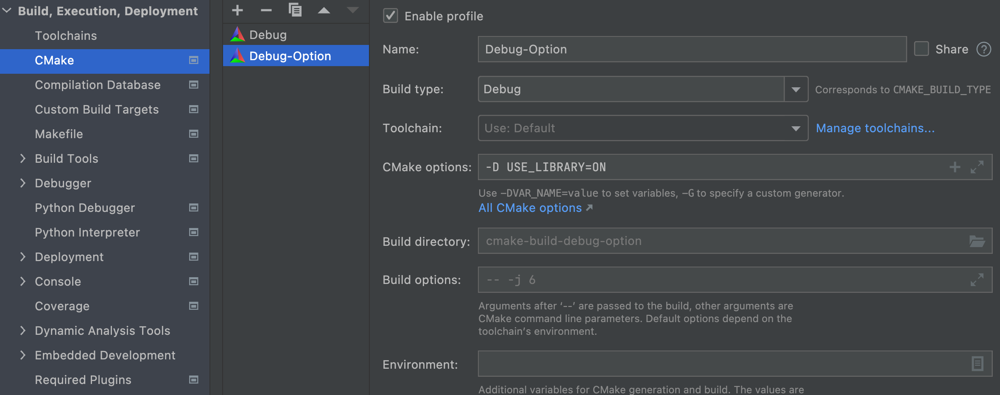

# CMake

## 快速入门

一个大项目（Project）内嵌多个子项目（SubProject）

一个子项目内有src、include、CMakeLists.txt，其中有一个子项目中有main.cpp


最外面的CMakeLists.txt，负责连接所有子项目：

```cmake
cmake_minimum_required(VERSION 3.20)
project(Project)
set(CMAKE_CXX_STANDARD 14)
add_subdirectory(subProject1)
add_subdirectory(subProject2)
```

subProject1（main.cpp所在的子项目）下面的CMakeLists.txt：

```cmake
file(GLOB_RECURSE srcs CONFIGURE_DEPENDS src/*.cpp include/*.h)
add_executable(subProject1 ${srcs})
target_include_directories(subProject1 PUBLIC include)
target_link_libraries(subProject1 PUBLIC subProject2)
```

subProject2下面的CMakeLists.txt：

```cmake
file(GLOB_RECURSE srcs CONFIGURE_DEPENDS src/*.cpp include/*.h)
add_library(subProject2 STATIC ${srcs})
target_include_directories(subProject2 PUBLIC include)
```

## 一：CMake基础语法

### CMakeLists.txt

我们将CMake指令放在`CMakeLists.txt`文件中

```cmake
#设置CMake所需最低版本
cmake_minimum_required(VERSION 3.20)
#设置项目名称为CMakeStudy，支持的语言为C++（CXX表示C++）
project(CMakeStudy LANGUAGES CXX)
#设置创建的新目标名称：一个名叫CMakeStudy的可执行文件
#这个可执行文件是通过编译和链接源文件main.cpp生成的
add_executable(CMakeStudy main.cpp)
```

- CMake语言不区分大小写，但参数区分大小写
- CMake的缺省默认语言为C++

### 构建

写好`CMakeLists.txt`文件后，在命令行中输入：

```shell
$cmake -H. -Bbuild
```

这个命令会搜索当前目录下的根`CMakeLists.txt`文件，创建一个`build`目录，在其中生成所有的代码

一般我们不会在源码内部构建，因为这会污染源码的目录树

### 链接

如果项目中有多个文件，如


可以改目标生成

```cmake
add_executable(hello main.cpp Message.cpp Message.h)
```

但是这种改法太麻烦了，每添加一个文件就要在后面添一端，最后这东西会特别长

我们可以把这个类编译成一个（静态）库，然后再将库链接到可执行文件中（你还记得c++编译器的编译步骤吗？）

```cmake
cmake_minimum_required(VERSION 3.20)
project(CMakeStudy LANGUAGES CXX)
#将两个文件编译成库
add_library(message STATIC Message.h Message.cpp)
#目标不变
add_executable(hello main.cpp)
#链接
target_link_libraries(hello message)
```

此外，我们能在buid目录中找到一个名为/形如`libmessage.a`的文件，这就是编译得到的静态库

#### add_library

```cmake
add_library(message STATIC Message.h Message.cpp)
```

- 第一个参数是目标名，后续可以使用该名来引用库

- 第二个参数是库的种类
  - STATIC：静态库
  - SHARED：动态库
  - OBJECT：对象库（将代码编译到可执行文件内部的静态库）
  - MODULE：一种不会链接到项目中任何目标的动态共享对象（DSO），可以运行时动态加载

此外CMake还有一些不会出现在构建系统里的库

- IMPORTED：项目外部的库，用于对现有依赖项进行构建，认为是不可变的
- INTERFACE：也是项目之外的库，但是可变
- ALIAS：对已有的库做别名

#### 条件语句

在讲链接时，我们给出了两种编译方法，我们希望能在两种方式间切换

```cmake
cmake_minimum_required(VERSION 3.20)
project(CMakeStudy LANGUAGES CXX)
#引入一个新变量USE_LIBRARY，设置为OFF
set(USE_LIBRARY OFF)
#打印信息
message(STATUS "Compile sources into a library? ${USE_LIBRARY}")
set(BUILD_SHARED_LIBS OFF)
#引入一个list变量: _sources，包含两个文件
list(APPEND _sources Message.h Message.cpp)
#判断，若USE_LIBRARY为真，则编译成库
if(USE_LIBRARY)
    add_library(message ${_sources})
    add_executable(hello main.cpp)
    target_link_libraries(hello message)
else()
    add_executable(hello main.cpp ${_sources})
endif()
```

#### 逻辑变量

- true：`1`、`ON`、`YES`、`true`、`Y`、非零数
- false：`0`、`OFF`、`NO`、`false`、`N`、`IGNORE`、`NOTFOUND`、空字符串、以`-NOTFOUND`为后缀

#### 全局变量

CMake有一些全局变量，修改他们可以起到配置作用，这里设置的

```cmake
set(BUILD_SHARED_LIBS OFF)
```

当设置为OFF时，可以使`add_library`不用传递第二个参数

### 用户选项

在上面我们引入了一个条件语句，但是是硬编码的。我们希望用户可以控制`USE_LIBRARY`，于是可以使用`option`

```cmake
#set(USE_LIBRARY OFF)
option(USE_LIBRARY "Compile sources into a library" OFF)
```

将上面下面的`set`替换为`option`，运行

```shell
$cmake -D USE_LIBRARY=ON
```

如果是Clion可以配置



### 构建类型

| 类型           | 有无优化               |
| -------------- | ---------------------- |
| Debug          | 没有优化，带调试符号   |
| Release        | 有优化，没有调试符号   |
| RelWithDebInfo | 有少量优化，带调试符号 |
| MinSizeRel     | 不增加代码大小来优化   |

### 编译选项

```cmake
cmake_minimum_required(VERSION 3.20)
project(CMakeStudy LANGUAGES CXX)

list(APPEND flags "-fPIC" "-Wall")
if(NOT WIN32)
    list(APPEND flags "-Wextra" "-Wpedantic")
endif()
#添加一个库
add_library(message
    STATIC
        Message.h
        Message.cpp
)
#为库设置编译选项
target_compile_options(message
    PRIVATE
        ${flags}
)
#添加可执行目标
add_executable(hello main.cpp)
#为可执行目标设置编译选项
target_compile_options(hello
    PRIVATE
        "-fPIC"
)
#链接
target_link_libraries(hello message)
```

| 可见性    | 含义                                                         |
| --------- | ------------------------------------------------------------ |
| PRIVATE   | 编译选项仅对目标生效，不会传递（hello链接了message，但不会接受message的编译选项） |
| INTERFACE | 编译选项对目标生效，并传递给相关目标                         |
| PUBLIC    | 编译选项对目标和使用它的目标生效                             |

`-Wall`、`-Wextra`等是警告标志

### 循环

```cmake
foreach(_source ${sources_with_lower_optimization})
  get_source_file_property(_flags ${_source} COMPILE_FLAGS)
  message(STATUS "Source ${_source} has the following extra COMPILE_FLAGS: ${_flags}")
endforeach()
```

## 二：环境检查

### 检查平台

我们要处理如下的C++源码（hello-world.cpp）

```c++
std::string say_hello() {
#ifdef IS_WINDOWS
  return std::string("Hello from Windows!");
#elif IS_LINUX
  return std::string("Hello from Linux!");
#elif IS_MACOS
  return std::string("Hello from macOS!");
#else
  return std::string("Hello from an unknown system!");
#endif
}
```

CMake可以加入

```cmake
#查询操作系统
if(CMAKE_SYSTEM_NAME STREQUAL "Linux")
	#设置宏
  target_compile_definitions(hello-world PUBLIC "IS_LINUX")
endif()
if(CMAKE_SYSTEM_NAME STREQUAL "Darwin")
  target_compile_definitions(hello-world PUBLIC "IS_MACOS")
endif()
if(CMAKE_SYSTEM_NAME STREQUAL "Windows")
  target_compile_definitions(hello-world PUBLIC "IS_WINDOWS")
endif()
```

### 检查编译器

```cmake
if(CMAKE_CXX_COMPILER_ID MATCHES Intel)
	...
endif()
if(CMAKE_CXX_COMPILER_ID MATCHES GNU)
	...
...
```

### 检查处理器架构

```cmake
if(CMAKE_SIZEOF_VOID_P EQUAL 8)
	#64bits
else()
	#32bits
endlf()
```

## 三：链接外部库

查找名为OpenCV的包，如果没找到就报错

```cmake
find_package(OpenCV REQUIRED)
```

该函数的本质就是去寻找一个`包名-config.cmake`文件

### 链接静态库

1. 在项目根目录新建lib文件夹
2. 将要链接的静态库（`test_library.a`）复制到lib文件夹中
3. 找包

```cmake
find_library(TEXT_LIBRARY test_library lib)
```

4. 链接

```cmake
target_link_libraries(testapp LINK_PUBLIC &{TEST_LIBRARY})
```

### 链接动态库

### 常用库

#### Eigen

Eigen是一个纯头文件实现的线性代数库，在mac上可以使用brew安装

1. 安装（记住eigen的版本）

```shell
$brew install eigen
```

2. 将Eigen链接到系统文件夹（brew一般会自动链接）

```shell
$brew link --overwrite eigen
```

3. 链接

```cmake
#寻找Eigen包，并附带包版本
find_package(Eigen3 3.4 REQUIRED CONFIG)
#若找到，则打印信息
if (TARGET Eigen3::Eigen)
    message(STATUS "Eigen3 ${EIGEN3_VERSION_STRING} found in ${EIGEN3_INCLUDE_DIR}")
endif ()
#目标
add_executable(path-info main.cpp)
#链接
target_link_libraries(path-info
        PUBLIC
        Eigen3::Eigen
        )
```

```c++
#include <iostream>
#include <Eigen/Dense>

int main(int argc, char **argv){
    int dim = std::atoi(argv[1]);
    Eigen::MatrixXd A = Eigen::MatrixXd::Random(dim, dim);
    std::cout << A;
    return 0;
}
```

### brew的用法

这里提一嘴Homebrew，这是一个mac上非常好用的包管理器，可以非常“优雅”地安装软件（安装在`/usr/local/Cellar`目录，安装目录软链接到`/usr/local/opt`，bin目录执行文件链接到`/usr/local/bin`中（opt也有可能在根目录）

常用命令

```bash
$ brew -v     # 安装完成后可以查看版本
$ brew --help # 简洁命令帮助
$ man brew    # 完整命令帮助

$ brew search git    # 搜索软件包
$ brew info git      # 查看软件包信息
$ brew home git      # 访问软件包官方站(用浏览器打开)

$ brew install git   # 安装软件包(这里是示例安装Git版本控制)
$ brew uninstall git # 卸载软件包
$ brew list          # 显示已经安装的所有软件包
$ brew list --versions # 查看你安装过的包列表（包括版本号）

$ brew update        # 同步远程最新更新情况，对本机已经安装并有更新的软件用*标明
$ brew outdated      # 查看已安装的哪些软件包需要更新
$ brew upgrade git   # 更新单个软件包
$ brew deps php      # 显示包依赖

$ brew cleanup       # 清理所有已安装软件包的历史老版本
$ brew cleanup git   # 清理单个已安装软件包的历史版本
$ brew cleanup -n    # 查看哪些软件包要被清除
```


## 参考资料

[Clion CMake](https://www.jetbrains.com/help/clion/quick-cmake-tutorial.html?keymap=secondary_macos#seealso)

[CMake菜谱](https://www.bookstack.cn/read/CMake-Cookbook/content-preface-preface-chinese.md)

[小鹏老师](https://www.bilibili.com/video/BV1V84y117YU)
