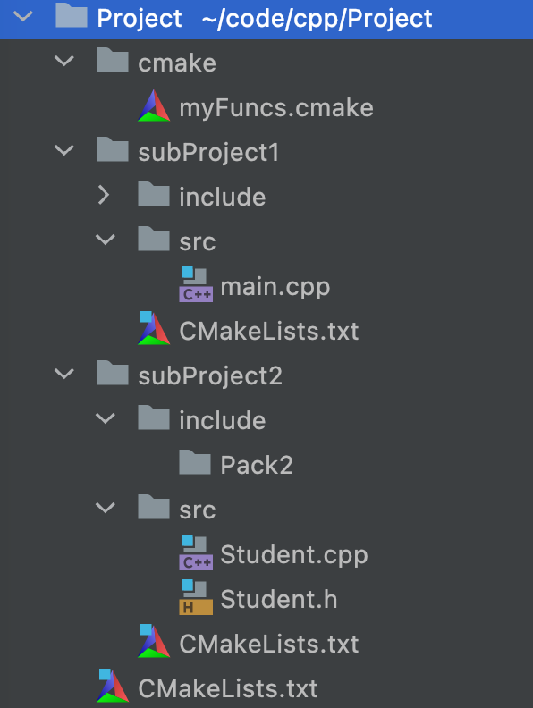
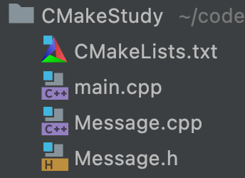

# CMake

## 小鹏老师笔记

[小鹏老师](https://www.bilibili.com/video/BV1V84y117YU)

### C++项目结构

一个大项目（Project）内嵌多个子项目（SubProject）

一个子项目内有src、include、CMakeLists.txt，其中有一个子项目中有main.cpp



最外面的CMakeLists.txt，负责连接所有子项目：

```cmake
cmake_minimum_required(VERSION 3.20)
project(Project)
set(CMAKE_CXX_STANDARD 14)
add_subdirectory(subProject1)
add_subdirectory(subProject2)
```

subProject1（main.cpp所在的子项目）下面的CMakeLists.txt：

```cmake
file(GLOB_RECURSE srcs CONFIGURE_DEPENDS src/*.cpp include/*.h)
add_executable(subProject1 ${srcs})
target_include_directories(subProject1 PUBLIC include)
target_link_libraries(subProject1 PUBLIC subProject2)
```

subProject2下面的CMakeLists.txt：

```cmake
file(GLOB_RECURSE srcs CONFIGURE_DEPENDS src/*.cpp include/*.h)
add_library(subProject2 STATIC ${srcs})
target_include_directories(subProject2 PUBLIC include)
```

### 第三方库

查找名为OpenCV的包，如果没找到就报错

```cmake
find_package(OpenCV REQUIRED)
```

该函数的本质就是去寻找一个`包名-config.cmake`文件

## CMake菜谱

### 一：从可执行文件到库

[CMake菜谱](https://www.bookstack.cn/read/CMake-Cookbook/content-preface-preface-chinese.md)

#### CMakeLists.txt

我们将CMake指令放在`CMakeLists.txt`文件中

```cmake
#设置CMake所需最低版本
cmake_minimum_required(VERSION 3.20)
#设置项目名称为CMakeStudy，支持的语言为C++（CXX表示C++）
project(CMakeStudy LANGUAGES CXX)
#设置创建的新目标名称：一个名叫CMakeStudy的可执行文件
#这个可执行文件是通过编译和链接源文件main.cpp生成的
add_executable(CMakeStudy main.cpp)
```

- CMake语言不区分大小写，但参数区分大小写
- CMake的缺省默认语言为C++

#### 构建

写好`CMakeLists.txt`文件后，在命令行中输入：

```shell
$cmake -H. -Bbuild
```

这个命令会搜索当前目录下的根`CMakeLists.txt`文件，创建一个`build`目录，在其中生成所有的代码

一般我们不会在源码内部构建，因为这会污染源码的目录树

#### 链接

如果项目中有多个文件，如



可以改目标生成

```cmake
add_executable(hello main.cpp Message.cpp Message.h)
```

但是这种改法太麻烦了，每添加一个文件就要在后面添一端，最后这东西会特别长

我们可以把这个类编译成一个（静态）库，然后再将库链接到可执行文件中（你还记得c++编译器的编译步骤吗？）

```cmake
cmake_minimum_required(VERSION 3.20)
project(CMakeStudy LANGUAGES CXX)
#将两个文件编译成库
add_library(message STATIC Message.h Message.cpp)
#目标不变
add_executable(hello main.cpp)
#链接
target_link_libraries(hello message)
```

此外，我们能在buid目录中找到一个名为/形如`libmessage.a`的文件，这就是编译得到的静态库

##### add_library

```cmake
add_library(message STATIC Message.h Message.cpp)
```

- 第一个参数是目标名，后续可以使用该名来引用库

- 第二个参数是库的种类
  - STATIC：静态库
  - SHARED：动态库
  - OBJECT：对象库（将代码编译到可执行文件内部的静态库）
  - MODULE：一种不会链接到项目中任何目标的动态共享对象（DSO），可以运行时动态加载

此外CMake还有一些不会出现在构建系统里的库

- IMPORTED：项目外部的库，用于对现有依赖项进行构建，认为是不可变的
- INTERFACE：也是项目之外的库，但是可变
- ALIAS：对已有的库做别名

#### 条件语句

在讲链接时，我们给出了两种编译方法，我们希望能在两种方式间切换

```cmake
cmake_minimum_required(VERSION 3.20)
project(CMakeStudy LANGUAGES CXX)
#引入一个新变量USE_LIBRARY，设置为OFF
set(USE_LIBRARY OFF)
#打印信息
message(STATUS "Compile sources into a library? ${USE_LIBRARY}")
set(BUILD_SHARED_LIBS OFF)
#引入一个list变量: _sources，包含两个文件
list(APPEND _sources Message.h Message.cpp)
#判断，若USE_LIBRARY为真，则编译成库
if(USE_LIBRARY)
    add_library(message ${_sources})
    add_executable(hello main.cpp)
    target_link_libraries(hello message)
else()
    add_executable(hello main.cpp ${_sources})
endif()
```

##### 逻辑变量

- true：`1`、`ON`、`YES`、`true`、`Y`、非零数
- false：`0`、`OFF`、`NO`、`false`、`N`、`IGNORE`、`NOTFOUND`、空字符串、以`-NOTFOUND`为后缀

##### 全局变量

CMake有一些全局变量，修改他们可以起到配置作用，这里设置的

```cmake
set(BUILD_SHARED_LIBS OFF)
```

当设置为OFF时，可以使`add_library`不用传递第二个参数

#### 向用户显示选项
