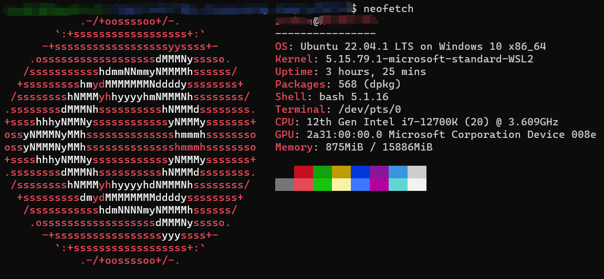

# Linux

虽说是Linux，实际上是WSL2，本文中所有出现Linux的地方，一律视为WSL2的Ubuntu

你可以使用neofetch查看系统信息



### 环境搭建

#### VS Code

1. 在Windows系统中安装VS Code，并选择添加PATH
2. 在WSL中如果要打开当前目录，直接输入

```bash
$code .
```

推荐安装VS Code的WSL插件

使用快捷键`CTRL+SHIFT+P`，打开命令面板，键入`WSL`，进行一些设置

#### Git

使用Git前需要先配置git config，可以输命令，也可以无脑用vscode该`.gitconfig`文件

```bash
$git config --global user.name "Your Name"
$git config --global user.email "youremail@domain.com"
```

### 常用命令

| 命令                   | 意义                           |                       |
| ---------------------- | ------------------------------ | --------------------- |
| ls -a                  | 查看当前目录内容               |                       |
| cd 路径名              | 路径跳转                       |                       |
| clear                  | 清空窗口                       |                       |
| find 文件名            | 找出当前文件夹内符合条件的文件 | 支持正则              |
| whoami                 | 查看当前用户身份               |                       |
| pwd                    | 查看当前工作目录               |                       |
| cat test.txt           | 查看文件内容                   |                       |
| cat > new.txt          | 新建文件                       |                       |
| cat file1 file2 > file | 合并文件                       |                       |
| mkdir 文件夹名         | 创建文件夹                     | -p可以创建多级文件夹  |
| cp src dst             | 复制文件                       |                       |
| kill 进程名            | 杀死进程                       |                       |
| unzip                  | 解压zip文件                    | 需要先安装unzip       |
| rm test.txt            | 删除文件                       | -r递归删文件夹 -f强删 |

### 文件访问

Windows访问Linux文件，路径为`\\wsl$\Ubuntu-20.04\home\username`

Linux访问Windows文件，路径为`/mnt/c/Users/username`

### apt-get

Linux内置的包管理器，可以非常优雅地安装管理各种包、软件

#### 安装

```bash
#安装git
$sudo apt-get install git
#安装tbb
$sudo apt-get install libtbb-dev
```

#### 查看所有已安装软件

```bash
#查看所有已安装软件（这个信息量巨大，而且有重复信息，不简易使用）
$sudo apt-cache search all
#查看所有已安装软件（去重）
$sudo apt-cache search all | wc
#查看所有名字中带gcc的软件
$sudo apt-cache search all | grep gcc
```

#### E: Unable to locate package

如果遇到这个报错，可以执行一次更新

```bash
$sudo apt-get update
```

#### C++安装清单

| 包名                          | 描述               |
| ----------------------------- | ------------------ |
| g++                           | C++编译器          |
| libtbb-dev                    | tbb并行库          |
| cmake                         | 项目构建           |
| git                           | 版本管理           |
| gfortran                      | fortran编译器      |
| liblapack-dev、liblapacke-dev | BLAS和LAPACK线代库 |
| gdb                           | 调试器             |
|                               |                    |

### Git使用

#### 拉取项目

项目拉取有两种常见方法

- ssh：需要配置SSH Key，只能拉自己的项目，但不提交时不需要账号密码

- https：非常方便，只需要git clone，而且可以拉别人的项目，但提交时需要输入账号密码
  - 其实你也可以在输入一次密码后输入

```bash
$git config --global credential.helper store
```

我们这里说的密码是token，可以去[Github](https://github.com/settings/tokens)生成token

#### 提交

```bash
#添加要提交的内容
$git add 文件名/文件夹名
#提交所有内容（不包含忽略文件），并设置提交信息为“这是一段话”
$git commit -a -m 这是一段话
```

