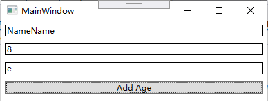
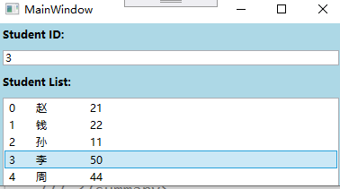
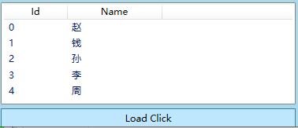
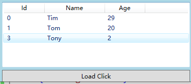
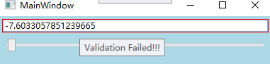

# WPF与C#

## 一、C#语法

### 委托

C#的委托类似于C++的函数指针，C#中，将参数`a,b`委托给了对象adder的Add方法，委托本质上是一种支持`()`运算符的**对象**。既然是对象，就可以有自己的成员和状态

```c#
delegate int Func(int a, int b);

class Adder{
  private int c = 0;
  
  public Adder(int c){ this.c = c; }
  
  public int Add(int a, int b){ return a+b; }
}
//Main(){...
Adder adder = new Adder(1);
Func f = adder.Add;
f(2,3);	//return 6
```

C#委托支持匿名委托和lambda表达式

```c#
delegate int Func(int a, int b);
//Main(){...
Func f = delegate(int a, int b){
  cout << a+b << endl;
};
Func f2 = (int a, int b)=>{
  cout << a+b << endl;
};
```

#### C++的函数指针

C/C++的函数指针是一个指向函数入口的指针，不具有对象的性质，只能指向非成员函数

```c++
typedef int(*Func)(int a, int b);

int Add(int a, int b){
    return a+b;
}

int main(int argc, char **argv){
    Func func = Add;
    std::cout << func(1,2);	//cout 3
    return 0;
}
```

当然，如果加上类型限制符，还是可以指向成员函数的

```C++
class Multiple{
public:
    int Mul(int a, int b){
        return a * b;
    }
};

typedef int(Multiple::*Fm)(int a, int b);

int main(int argc, char **argv){
    Multiple multiple;
    Fm f = &Multiple::Mul;
    std::cout << (multiple.*f)(3,4);
    return 0;
}
```

如果想让C++对委托具有对象的性质，我们可以重载`()`操作符

```c++
class Adder{
public:
    Adder(int c){ this->c = c; }
    int operator()(int a, int b){
        return a+b+c;
    }
private:
    int c;
};

int main(int argc, char **argv){
    Adder adder(1);
    std::cout << adder(2, 3);
    return 0;
}
```

### 事件

*这里的事件指CLR事件模型，详细内容见下文*

委托：把工作委托给了某个函数，可以直接调用

事件：订阅者侦听发行者，发行者可以通过回调函数间接让订阅者干事（而且订阅者具体干什么，要看订阅者心情，发行者无权过问）

```c#
//事件参数
public class MyEventArgs: EventArgs
{
  public string Args
  {
    private set;
    get;
  }
  public MyEventArgs(string args)
  {
    Args = args;
  }
}
//事件发行者
public class EventSource
{
  MyEventArgs eventArgs;

  public string Name;

  public EventSource(string args)
  {
    eventArgs = new MyEventArgs(args);
  }

  public delegate void handlerEvent(Object sender, MyEventArgs args);

  public event handlerEvent m_handler_event;

  public void Handler()
  {
    m_handler_event?.Invoke(this, eventArgs);
    //也可以写成 m_handler_event(this, eventArgs);
  }
}
```

```C#
//事件订阅者
class MainClass
{
  public static void Main(string[] args)
  {
    EventSource source = new EventSource("Event had been raised!");
    source.Name = "Tim";
    source.m_handler_event += new EventSource.handlerEvent(writeHello);
    //也可以写成 source.m_handler_event += writeHello;
    source.Handler();		//输出：Hello Tim, Event had been raised!
  }

  static void writeHello(Object sender, MyEventArgs args)
  {
    EventSource source = sender as EventSource;
    Console.WriteLine($"Hello {source.Name}, {args.Args}");
  }
}
```

最初我很好奇，我们注册了一个处理函数，`source.m_handler_event += writeHello`，但是好像没看到怎么传参进去。

其实是因为C#的委托本质是一个支持`()`运算符的对象，所有处理函数形式上跟委托一致，参数是委托对象的成员变量

一个事件可以注册多个处理函数，于是事件也称为多重委托

### Action

泛型委托

无参数`Action xxx = 函数`

```c#
public class Name
{
  public string InstanceName{ private set; get; }
  public Name(string name)
  {
    InstanceName = name;
  }
  public void DisplayName()
  {
    Console.WriteLine($"I'm {InstanceName}");
  }
}
public static void Main(string[] args)
{
  Name testName = new Name("Tim");
  Action showName = testName.DisplayName;
  showName();
}       
```

有参数`Action<参数类型> xxx = 函数`

```c#
public class Name
{
  public string InstanceName{ private set; get; }
  public Name(string name)
  {
    InstanceName = name;
  }
  public void DisplayName(string str)
  {
    Console.WriteLine($"I'm {InstanceName}, {str}");
  }
}
public static void Main(string[] args)
{
  Name testName = new Name("Tim");
  Action<string> showName = testName.DisplayName;
  showName("HHH");
}    
```


## 二、Binding

### 逻辑层与UI层

程序 = 数据 + 算法

三层结构：存储、逻辑、展示（UI）

逻辑层可以访问UI层的数据，但展示层不能访问逻辑层，UI层能显示信息，靠的是绑定逻辑层数据

```C#
this.textBoxName.SetBinding(TextBox.TextProperty, new Binding("Name") { Source = stu = new Student() });
```

UI层不仅可以绑定逻辑层数据，也可以绑定UI层数据

```C#
//为 Text属性设置 Binding为 slider1的...
<TextBox x:Name="textBox2" Text="{Binding Value, ElementName=slider1}" BorderBrush="Black" Margin="5"/>
```

在XAML中加入

```C#
xmlns:local="clr-namespace:BindingStudy"
```

即可在XAML中使用BindingStudy命名空间里C#定义的类

### 绑定的实现

绑定实现的机制：源对象的属性（Property）发生改变时，会Invoke一个事件，Binding负责侦听这个事件

```C#
class Student : INotifyPropertyChanged
{
    public event PropertyChangedEventHandler PropertyChanged;
    private string name;
    public string Name
    {
        get { return name; }
        set
        {
            name = value;
            if(this.PropertyChanged != null)
            {
                this.PropertyChanged.Invoke(this, new PropertyChangedEventArgs("Name"));
            }
        }
    }
}
```

### Path

源对象往往会有多个属性，我们可以使用Path，设置绑定那些属性，而且Path支持多级路径（简单说就是一直点下去）和索引器（Indexer）

```C#
<TextBox x:Name="textBoxName" BorderBrush="Black" Margin="5"/>
<TextBox x:Name="textBox1" Text="{Binding Path=Text.Length, ElementName=textBoxName, Mode=OneWay}" BorderBrush="Black" Margin="5"/>          
<TextBox x:Name="textBox2" Text="{Binding Path=Text.[3], ElementName=textBoxName, Mode=OneWay}" BorderBrush="Black" Margin="5"/>
```



此外Path也支持多级斜线（也是可以一直斜线下去，其中"/"就是自身）

```C#
this.textBoxName.SetBinding(TextBox.TextProperty, new Binding("/Length") { Source = stringList });
```

当源数据本身就是数据（比如int、string类型），我们可以不写Path，或者将Path省略为"."

```C#
this.textBlock1.SetBinding(TextBlock.TextProperty, new Binding(".") { Source = str });
```

### 集合

```XML
<StackPanel x:Name="stackPanel" Background="LightBlue">
    <TextBlock Text="Student ID:" FontWeight="Bold" Margin="5"/>
    <TextBox x:Name="textBoxId" Margin="5"/>
    <TextBlock Text="Student List:" FontWeight="Bold" Margin="5"/>
    <ListBox x:Name="listBoxStudents" Height="110" Margin="5">
        <ListBox.ItemTemplate>
            <DataTemplate>
                <StackPanel Orientation="Horizontal">
                    <TextBlock Text="{Binding Path=Id}" Width="30"/>
                    <TextBlock Text="{Binding Path=Name}" Width="60"/>
                    <TextBlock Text="{Binding Path=Age}" Width="30"/>
                </StackPanel>
            </DataTemplate>
        </ListBox.ItemTemplate>
    </ListBox>

</StackPanel>
public MainWindow()
{
    InitializeComponent();
    List<Student> stuList = new List<Student>()
    {
        new Student(){Id=0, Name="赵", Age=21},
        new Student(){Id=1, Name="钱", Age=22},
        new Student(){Id=2, Name="孙", Age=11},
        new Student(){Id=3, Name="李", Age=50},
        new Student(){Id=4, Name="周", Age=44},
    };
    this.listBoxStudents.ItemsSource = stuList;
    //this.listBoxStudents.DisplayMemberPath = "Name";

    Binding binding = new Binding("SelectedItem.Id") { Source = this.listBoxStudents };
    this.textBoxId.SetBinding(TextBox.TextProperty, binding);
}
```



### XML

SOAP（Simple Object Access Protocel，简单对象访问协议）：一种基于XML的数据交换协议

```XML
<?xml version="1.0" encoding="utf-8" ?>
<StudentList>
        <Student Id="0">
                <Name>赵</Name>
        </Student>
        <Student Id="1">
                <Name>钱</Name>
        </Student>
        <Student Id="2">
                <Name>孙</Name>
        </Student>
        <Student Id="3">
                <Name>李</Name>
        </Student>
        <Student Id="4">
                <Name>周</Name>
        </Student>
</StudentList>
<ListView x:Name="listViewStudents" Height="130" Margin="5">
    <ListView.View>
        <GridView>
            <GridViewColumn Header="Id" Width="80" DisplayMemberBinding="{Binding XPath=@Id}"/>
            <GridViewColumn Header="Name" Width="120" DisplayMemberBinding="{Binding XPath=Name}"/>
        </GridView>
    </ListView.View>
</ListView>
<Button Content="Load Click" Click="Button_Click" Height="25" Margin="5,0"/>
 private void Button_Click(object sender, RoutedEventArgs e)
{
    XmlDataProvider xdp = new XmlDataProvider();
    xdp.Source = new Uri(@"D:\code\BindingStudy\BindingStudy\RawData.xml");
    xdp.XPath = @"/StudentList/Student";

    this.listViewStudents.DataContext = xdp;
    this.listViewStudents.SetBinding(ListView.ItemsSourceProperty, new Binding());
}
```



### LINQ

LINQ（Language-Integrated Query，语言集成查询）：一种对象查询机制，查询的结果为IEnumerable<T>类型

```XML
<?xml version="1.0" encoding="utf-8" ?>
<StudentList>
        <Class>
                <Student Id="0" Name="Tim" Age="29"/>
                <Student Id="1" Name="Tom" Age="20"/>
                <Student Id="2" Name="Mess" Age="9"/>
        </Class>
        <Class>
                <Student Id="3" Name="Tony" Age="2"/>
                <Student Id="4" Name="Viv" Age="23"/>
                <Student Id="5" Name="Oio" Age="88"/>
        </Class>
</StudentList>
<ListView x:Name="listViewStudents" Height="130" Margin="5">
    <ListView.View>
        <GridView>
            <GridViewColumn Header="Id" Width="80" DisplayMemberBinding="{Binding Id}"/>
            <GridViewColumn Header="Name" Width="120" DisplayMemberBinding="{Binding Name}"/>
            <GridViewColumn Header="Age" Width="80" DisplayMemberBinding="{Binding Age}"/>
        </GridView>
    </ListView.View>
</ListView>
private void Button_Click(object sender, RoutedEventArgs e)
{
    XDocument doc = XDocument.Load(@"D:\code\BindingStudy\BindingStudy\RawData.xml");
    this.listViewStudents.ItemsSource =
        from element in doc.Descendants("Student")
        where element.Attribute("Name").Value.StartsWith("T")
        select new Student()
        {
            Id = int.Parse(element.Attribute("Id").Value),
            Name = element.Attribute("Name").Value,
            Age = int.Parse(element.Attribute("Age").Value)
        };
    
}
class Student
{
    public int Id { get; set; }
    public string Name { get; set; }
    public int Age { get; set; }
}
```



### 校验

“你永远不能相信来自前端的数据”

我们认为Source的数据一定是正确的，但Target的数据是有可能出现问题的

```C#
public partial class MainWindow : Window
{
    public MainWindow()
    {
        InitializeComponent();

        Binding binding = new Binding("Value") { Source = this.slider1 };
        binding.UpdateSourceTrigger = UpdateSourceTrigger.PropertyChanged;    //当源数据改变时进行校验
        RangeValidationRule rvr = new RangeValidationRule();
        rvr.ValidatesOnTargetUpdated = true;    //当Target数据改变时进行校验
        binding.ValidationRules.Add(rvr);
        binding.NotifyOnValidationError = true;
        this.textBox1.SetBinding(TextBox.TextProperty, binding);
        this.textBox1.AddHandler(Validation.ErrorEvent, new RoutedEventHandler(this.ValidationError));
    }

    //若校验失败，将失败信息添加到 ToolTip上
    void ValidationError(object sender, RoutedEventArgs e)
    {
        if(Validation.GetErrors(this.textBox1).Count > 0)
        {
            this.textBox1.ToolTip = Validation.GetErrors(this.textBox1)[0].ErrorContent.ToString();
        }
        else
        {
            this.textBox1.ToolTip = null;
        }
    }
}
<StackPanel x:Name="stackPanel" Background="LightBlue">
    <TextBox x:Name="textBox1" Margin="5"/>
    <Slider x:Name="slider1" Minimum="-10" Maximum="110" Margin="5"/>
</StackPanel>
class RangeValidationRule : ValidationRule
{
    //对数据范围进行校验，仅当在[0,100]时校验通过，校验失败时返回信息
    public override ValidationResult Validate(object value, CultureInfo cultureInfo)
    {
        double d = 0;
        if(double.TryParse(value.ToString(), out d))
        {
            if(d >= 0 && d <= 100)
            {
                return new ValidationResult(true, null);
            }
        }
        return new ValidationResult(false, "Validation Failed!!!");
    }
}
```



### 数据转换

Slider的Value是double类型，TextBox的Text是string类型，但是Binding后数据往来自如，是因为数据转化机制

```C#
class ClassAToClassBConverter : IValueConverter
{
    public object Convert(object value, Type targetType, object parameter, CultureInfo culture)
    {
        ...
    }

    public object ConvertBack(object value, Type targetType, object parameter, CultureInfo culture)
    {
        ...
    }
}
<Window x:Class="BindingStudy.MainWindow"
        ...
    <Window.Resources>
        <local:ClassAToClassBConverter x:Key="atb"/>
    </Window.Resources>
    <StackPanel x:Name="stackPanel" Background="LightBlue">
        ...
        <Image Width="20" Height="20" Source="{Binding Path=A, Converter={StaticResource atb}}"/>
    </StackPanel>
</Window>
```

## 三、属性

### 英语中的属性

Property是物体自带的属性

Attribute是物体的描述属性

张三是中国人，身上有一百块钱。中国人是张三的Attribute, 100块钱是张三的property

### C#中的属性

将字段设为private，使用一对非private的方法来包装它，以实现**高内聚**

C#中提供语法糖，将Get和Set合并为了属性（Property），这种属性也被称为CLR（Common Language Runtime）属性

```C#
class Student
{
    private string name;
    public string Name { get; set; }
}
```

此外反编译后发现，属性的本质是两个函数，并不会增加字段数量（不额外占内存）

### 依赖属性

（WPF属性加强版）

依赖属性（Dependency Property）可以自己没有值，通过Binding从数据源获得值

拥有依赖属性的对象被称为依赖对象

传统开发中，对象所占用的内存在进行实例化时就确定（分配）了，而依赖属性可以允许对象不分配部分空间

```C#
class Student : DependencyObject
{
    //依赖对象的 CLR封装
    public string Name
    {
        get { return (string)GetValue(NameProperty); }
        set { SetValue(NameProperty, value); }
    }
    //依赖对象
    public static readonly DependencyProperty NameProperty = DependencyProperty.Register("Name", typeof(string), typeof(Student));  
    //Binding封装
    public BindingExpressionBase SetBinding(DependencyProperty dp, BindingBase binding)
    {
        return BindingOperations.SetBinding(this, dp, binding);
    }
}
```

- "Name"：指明使用哪一个 CLR属性作为这个依赖属性的包装器 (Wrapper)
- typeof(string)：指明此依赖属性用来储存什么类型的值
- typeof(Student))：指明此依赖属性要注册关联到谁身上 

```XML
<StackPanel x:Name="stackPanel" Background="LightBlue">
    <TextBox x:Name="textBox1" BorderBrush="Black" Margin="5"/>
    <TextBox x:Name="textBox2" BorderBrush="Black" Margin="5"/>
</StackPanel>
public partial class MainWindow : Window
{
    Student stu;
    public MainWindow()
    {
        InitializeComponent();

        stu = new Student();
        stu.SetBinding(Student.NameProperty, new Binding("Text") { Source = textBox1 });
        textBox2.SetBinding(TextBox.TextProperty, new Binding("Name") { Source = stu });
    }
}
```

我们还发现，依赖对象并没有实现INotifyPropertyChanged接口，但是当期值发生改变时，与之相关的Binding对象依然可以得到通知，于是依赖对象是天生的合格源数据

在VS中，输入propdp并按两次tab，就能得到一个依赖属性模板

#### 依赖属性的注册

前文我们获得依赖对象的实例时，是通过`DependencyProperty.Register`注册得到：

1. 创建DependencyProperty实例，并使用其CLR属性名的哈希异或宿主类型的哈希，得到key（通过其他算法，保证唯一）
2. 将key和实例存储到一张全局的HashTable上

```C#
GlobalIndex = CLR属性名的HaseCode XOR 宿主类型HashCode
```

于是运行时只要知道CLR属性名和宿主，就能找到依赖对象实例

#### 依赖属性的读写

依赖属性对象的作用是检索真正的属性值，而非存储属性值

每个DependencyObject实例都自带一个数组，当某个依赖属性的值要被读取时，算法会在这个数组中检索。而用于检索的键值，实际上就是依赖属性的GlobalIndex 

也就是说，这个被static readonly修饰的属性，它的作用是一个“标记”，当你需要找某个东西时，就来这里拼一个id，用id查数组

### 附加属性

附加属性（Attached Properties）：一个属性本不属于某个对象，但由于某种需求后来附加上。换句话说，将对象放入一个特定环境后，才会具有出来的属性

举个例子，比如Human这个类，它可以有很多很多种属性，现在我们想在里面加入一个新的需求，如果我们直接改动这个类，过于繁琐。而如果提前留好空，那么有时候又会空间浪费

附加属性的作用就是让宿主和属性解耦，让宿主的设计更为灵活

## 四、事件

### 消息

事件的前身是消息（Message），Windows系统就是一个消息驱动的操作系统，后来微软为了降低开发难度，将消息系统封装为了事件模型

### CLR事件模型

CLR事件模型由三部分组成

- 事件的拥有者：即消息的发送者
- 事件的响应者：即消息的接收者，它可以使用事件处理器（Event Handler）对事件做相应
- 事件的订阅关系：事件的拥有者可以随时激发事件，但只有关注（订阅）了这个事件的响应者会对此产生反应

事件本质上就是一个使用event关键字修饰的委托（Delegate）类型成员变量，事件处理器是一个函数

A订阅了B，实际上就是让B.Event和A.EventHandler关联起来

事件激发就是B.Event被调用

#### 举例

Windows Form按按钮

| 事件的拥有者 | button                                                       |
| ------------ | ------------------------------------------------------------ |
| 事件         | button.Click                                                 |
| 事件的响应者 | 窗体                                                         |
| 事件处理器   | this.button_Click()                                          |
| 订阅关系     | this.button.Click += new System.EventHandler(this.button_Click) |

### 路由事件

（WPF事件加强版）

路由事件没有显示订阅关系

- 事件拥有者只负责激发事件，至于谁会倾听，他并不知道
- 事件响应者装有事件倾听器，若有事件传递于此，可以决定事件是否可以继续传递
  - 如果事件不归他管，那就踢给下一个人，继续传播
  - 若事件归他管，那就进行处理，并判断是否还需要传给下一个人

```C#
public abstract class ButtonBase : ContentControl, ICommandSource
{
    //声明并注册路由事件
    public static readonly RoutedEvent ClickEvent = EventManager.RegisterRoutedEvent("Click", 
        RoutingStrategy.Bubble, typeof(RoutedEventHandler), typeof(ButtonBase));

    //为路由事件添加 CLR事件包装器
    public event RoutedEventHandler Click
    {
        add { this.AddHandler(ClickEvent, value); }
        remove { this.RemoveHandler(ClickEvent, value); }
    }
    
    //激活路由事件的方法
    protected virtual void OnClick()
    {
        RoutedEventArgs newEvent = new RoutedEventArgs(ButtonBase.ClickEvent, this);
        this.RaiseEvent(newEvent);
    }
}
```

WPF路由事件有三种策略

- Bubble：冒泡式，激发者向其上级一层一层路由，直到到根，路径是确定且唯一
- Tunnel：隧道式，激发者向其下级一层一层路由，路径有很多，但朝向响应者移动，就像形成一个隧道
- Direct：直达式，类似CLR事件，直接向响应者发送事件

## 五、命令

事件不具有约束力，事件接收者使用自己的行为响应事件

命令具有约束力，当命令到达某个组件时，会主动调用组件的某个方法

### 命令系统

- 命令（Command）：实现ICommand接口
- 命令源（Command Source）：实现ICommandSource接口
- 命令目标（Command Target）：实现IInputElement接口
- 命令关联（Command Binding）
