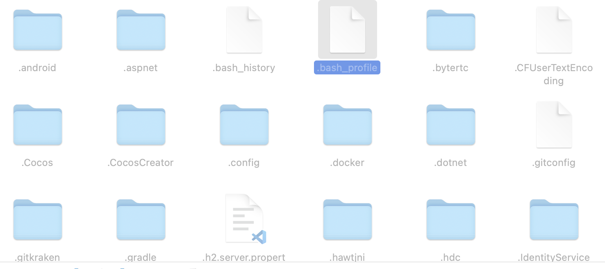
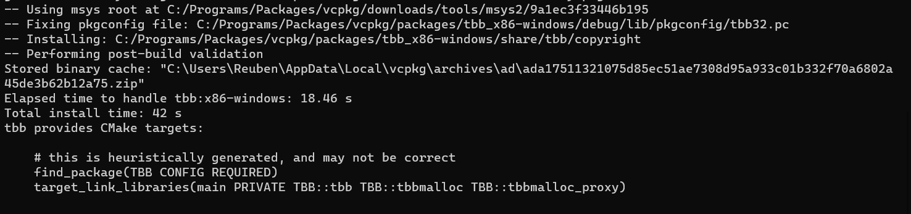
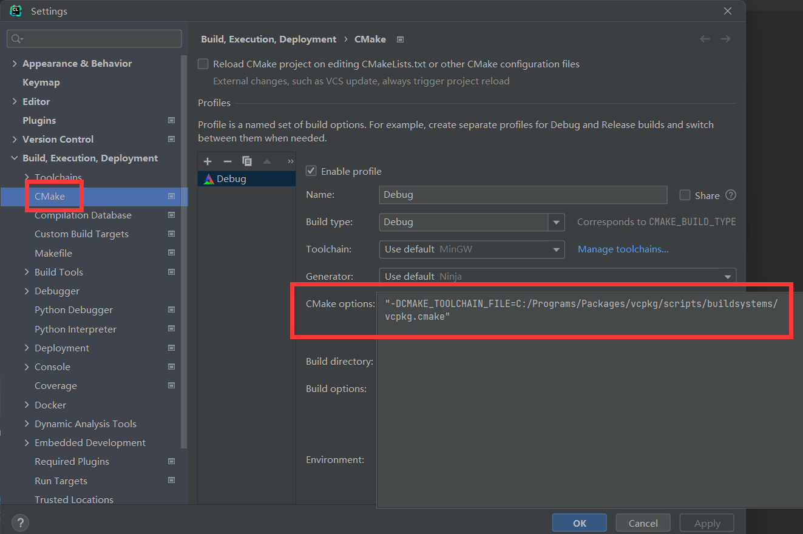

# 环境配置

- 你拿到新的电脑、学习某种新语言、框架，第一件事是？配环境

万事开头难，很多人的学习热情在配环境中就消磨没了。此外就算各种搜资料配置成功了，很快就忘了，下回还给从头再来。于是好做记录非常重要

### Mac配置Python

有人说，Chrome是最成功的浏览器，因为IE浏览器巅峰时期市场份额都不到八成，而现在，几乎每台电脑里都有五六十个Chrome

Python也是如此，很多人电脑里可能会有相当的Python版本，而且兼容性很差，而且一次只能用一个

Python的安装方式特别多，网上能搜一大把，还有各种“优雅”的安装方式，我这里就记录一个我安装成功的

#### 安装

最无脑的安装方法，去[官网](https://www.python.org/downloads/macos/)下安装包，一路next就行

#### 配置环境变量

很多人安装后发现在命令行里敲`python`，发现没有这个命令，要敲`python3`，因为你没配置环境变量

0. 查看python路径

```shell
#查找正在使用的python路径
$which python
#查找电脑里所有的python路径
$where python
#查看python版本
$python --version
```

1. 打开终端，来到用户目录（一般就是启动的目录）

2. 新建/打开文件`.bash_profile`（方式有很多）

```shell
#新建
$vim ~/.bash_profile
$touch ~/.bash_profile
#打开
$open -e .bash_profile
```

你甚至可以双击打开（mac使用组合键`command+shift+.`显示隐藏文件）



3. 输入配置信息

```bash
#环境变量
PATH=”/usr/local/bin:${PATH}”
export PATH
#环境变量
PATH=”/Library/Frameworks/Python.framework/Versions/3.11/bin:${PATH}”
export PATH
#设置别名
alias python="/Library/Frameworks/Python.framework/Versions/3.11/bin/python3"
```

Windows的环境变量也是让PATH=xxx

4. 编译配置文件

```bash
$source ~/.bash_profile
```

5. 配置zsh

然后你也可能发现，你关闭终端后一切又回去了，你需要重新做第四步。这是因为mac用户大概率会用zsh，这东西默认不加载环境变量，你打开文件`~/.zshrc`，在文件最后加上

```shell
$source ~/.bash_profile
```

就行了

此外通过这个方法你可以轻松切换正在使用的python版本


### vcpkg

这是一个Windows包管理器

1. 安装visual studio、powershell
2. git下载vcpkg

```powershell
> git clone https://github.com/microsoft/vcpkg
```

3. 运行`bootstrap-vcpkg.bat`

如果要下载某个包，比如tbb

1. 来到vcpkg的根目录
2. 运行

```powershell
> .\vcpkg\vcpkg install tbb
```

如果想安装64位的，输入

```powershell
> .\vcpkg\vcpkg install tbb:x64-windows
```

然后我们就能看到



如果想让所有Visual Studio项目都可以使用这个包，我们输入

```powershell
> vcpkg integrate install
```

对于Clion项目，我们可以在CMake Option中设置cmake文件位置


