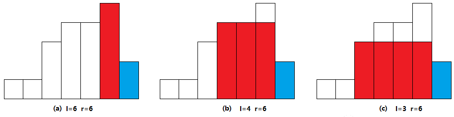
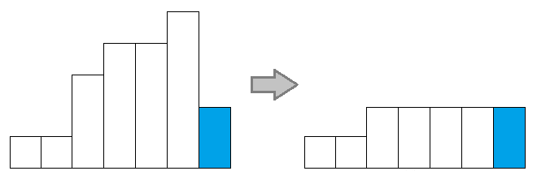
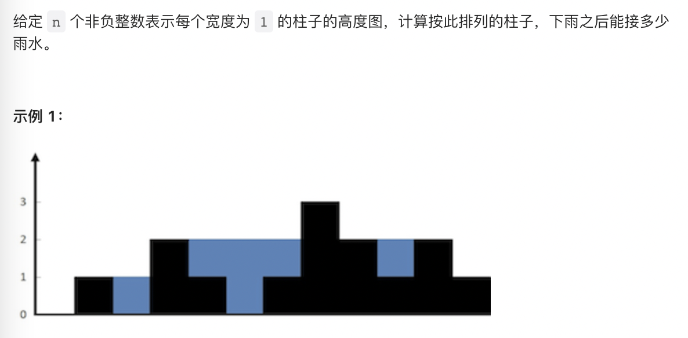
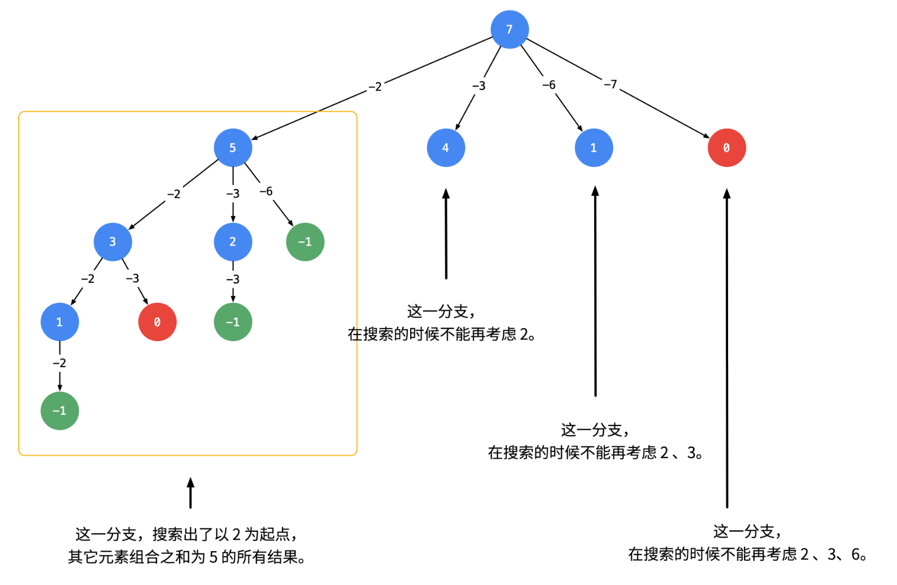

# 算法

## 一：语言

### 常用STL

#### vector

- `push_back(t)`
- `vector<int> ans`等价于`{1,2,3}`

#### stack

- `top()`
- `push(t)`
- `pop()`

#### queue

- `front()`
- `back()`
- `push(t)`
- `pop()`

#### unordered_map

- 创建

```c++
unordered_map<string, string> m = {
	{"Key1", "Value1"},
	{"Key2", "Value2"},
	{"Key3", "Value3"}
};
m.emplace("Key4", "Value4");	//插入键值对
string s = m["Key4"];		//取值
m["Key5"] = "Value5";		//插入键值对
```

- 判断是否含有某个key

```c++
if(map.find(keyName) == map.end()){...}	//这个说明不在
```

- 取值

```c++
string s = m[key];	//如果key不存在，那么s为默认值
m2[key]++;	//如果value是int类型，支持自增，而且key不存在时默认为0，自增后存在
```


#### unordered_set

- 插入`insert()`
- 删除`erase()`
- 判断时候含有某个元素

```c++
if(set.find(item) == set.end()){...}	//说明不存在
```

#### ListNode

```c++
ListNode* node = new ListNode(0, head);
```

### 字符串

字符串也是一种stl，所以满足很多stl的性质，但又有很多单独的内容

#### 字符串插入字符

```c++
s.push_back(c);
```

#### sstream

```c++
stringstream ss;
string s;
ss << 100 << ' ' << 100;
ss >> s;	//此时s == "100 100"	
```

### 常用函数

- `sort(v.begin(), v.end())`
- `to_string(i)`：int转string
- `stoi(s)`：string转int
- `memset(指向数组的指针, 要赋的值, sizeof(dis))`

## 二：数据结构

### 字符串

#### split

```c++
auto split = [](const string& s, char delim) -> vector<string> {
        vector<string> ans;
        string cur;
        for (char ch: s) {
            if (ch == delim) {
                ans.push_back(move(cur));
                cur.clear();
            }
            else {
                cur += ch;
            }
        }
        ans.push_back(move(cur));
        return ans;
    };
vector<string> names = split(path, '/');
```

### 单调栈

#### 最大内接矩形（单调递增栈）

题目略

如果我们从左向右，发现矩形一直是递增的，直到第$i$个矩形（蓝色），于是得到一下几个候选矩形，分别计算三个矩形的面积



求完面积后，蓝色向右移动，在移动之前，先进行**削峰**



我们发现，蓝色左边的矩形，就算以后遍历的时候被用到，参与计算的高度最多也只是这个蓝色矩形的高度，那么我们就直接把左边的高度改成蓝色矩形的高度，然后我们惊奇的发现，削峰后，左边的矩形又恢复递增了

于是问题变成

- 从左向右遍历
  - 如果`h(i) >= h(i-1)`，那么将`i`加入递增矩形中
  - 否则，将`i`设为右边界，计算左边每个候选矩阵的面积
    - 将左边每个矩阵进行削峰，将`i`加入递增矩形中

于是问题变成了一个维护递增矩形的问题，可以用单调栈来实现

- 从左向右遍历
  - 如果`s.empty() || s.top() < h[i]`，入栈
  - 否则，循环遍历栈顶元素
    - 如果`s.top() >= h[i]`，栈顶出栈，计算面积
      - 若面积大于当前最大面积，则更新最大面积
      - `ans = max(ans, (i - s.top()) * h[s.top()])`
    - 将最后一次出栈顶元素入栈，并削峰`s.top() = h[i]`

```c++
class Solution {
public:
    int largestRectangleArea(vector<int>& heights) {
        heights.push_back(-1);	//以防数组单增
        stack<int> st;  //单调递增栈，栈中存储的是元素的id
        int ans = 0;
        int topIndex = 0;   //如果要维持单增，栈顶元素的（最左）位置
        int len = heights.size();
        for(int i = 0 ; i < len; i++){
            if(st.empty() || heights[st.top()] < heights[i]){
                st.push(i);    //单增则入栈
            }
            else{
                while(!st.empty() && heights[st.top()] >= heights[i]){
                    //如果h[i]比栈顶小，那么一直出栈，直到恢复为单增（空也是单增）
                    topIndex = st.top();
                    st.pop();
                    ans = max(ans, (i - topIndex) * heights[topIndex]);
                }
                st.push(topIndex);
                heights[topIndex] = heights[i]; //削峰
            }
        }
        return ans;
    }
};
```

#### 接雨水（单调递减栈）



```c++
class Solution {
public:
    int trap(vector<int>& height) {
        int ans = 0;
        stack<int> stk;
        int n = height.size();
        for (int i = 0; i < n; ++i) {
            while (!stk.empty() && height[i] > height[stk.top()]) {
                int top = stk.top();
                stk.pop();
                if (stk.empty()) {
                    break;
                }
                int left = stk.top();
                int currWidth = i - left - 1;
                int currHeight = min(height[left], height[i]) - height[top];
                ans += currWidth * currHeight;
            }
            stk.push(i);
        }
        return ans;
    }
};
```


### 图论

#### 颜色渲染

```c++
class Solution {
public:
    const int dx[4] = {1, 0, 0, -1};
    const int dy[4] = {0, 1, -1, 0};
    vector<vector<int>> floodFill(vector<vector<int>>& image, int sr, int sc, int newColor) {
        int currColor = image[sr][sc];
        if (currColor == newColor) return image;
        int n = image.size(), m = image[0].size();
        queue<pair<int, int>> que;
        que.emplace(sr, sc);
        image[sr][sc] = newColor;
        while (!que.empty()) {
            int x = que.front().first, y = que.front().second;
            que.pop();
            for (int i = 0; i < 4; i++) {
                int mx = x + dx[i], my = y + dy[i];
                if (mx >= 0 && mx < n && my >= 0 && my < m && image[mx][my] == currColor) {
                    que.emplace(mx, my);
                    image[mx][my] = newColor;
                }
            }
        }
        return image;
    }
};

```

#### 岛屿问题

本质就是遍历图上每一个点，遇到一个符合条件的，通过深搜将所有相邻的点进行标记

##### 被围绕的区域

```
给你一个 m x n 的矩阵 board ，由若干字符 'X' 和 'O' ，找到所有被 'X' 围绕的区域，并将这些区域里所有的 'O' 用 'X' 填充。
```

```C++
class Solution {
public:
    void solve(vector<vector<char>>& board) {
        int lenX = board.size();
        int lenY = board[0].size();
        for(int i = 0; i < lenX; i++){
            for(int j = 0; j < lenY; j++){
                //从边缘开始
                bool isEdge = i == 0 || j == 0 || i == lenX-1 || j == lenY -1;
                if(isEdge && board[i][j] == 'O'){
                    dfs(i, j, board);
                }
            }
        }
        for(int i = 0; i < lenX; i++){
            for(int j = 0; j < lenY; j++){
                if(board[i][j] == 'O'){
                    board[i][j] = 'X';
                }
                else if(board[i][j] == '#'){
                    board[i][j] = 'O';
                }
            }
        }
    }
    void dfs(int x, int y, vector<vector<char>> & board){
        if(x < 0 || y < 0 || x >= board.size() || y >= board[0].size()){
            return;		//越界
        }
        if(board[x][y] == 'X' || board[x][y] == '#'){
            return;		//若不符合条件 || 已经访问过
        }
        board[x][y] = '#';
        dfs(x-1, y, board);
        dfs(x+1, y, board);
        dfs(x, y-1, board);
        dfs(x, y+1, board);
    }
};
```

##### 岛屿数量

```
请你计算二维网格中岛屿的数量。
```

- 遍历网格
  - 找到一个陆地，`ans++`
  - 将这个陆地相邻的陆地（1）全变成海洋（0）

##### 岛屿最大面积

```
请你计算二维网格中岛屿的最大面积
```

- 遍历网格
  - 找到一个陆地
  - 深搜所有与之相邻的陆地，得到面积`v`
  - `max = v > max ? v : max`

##### 封闭岛屿的数量

```
上下左右都是水的到被称为封闭岛屿，问封闭岛屿的数量
```

什么样的岛不是封闭岛屿呢？与边界有接壤的就不封闭了

### 哈希表

#### 转化为罗马数字

`unordered_map`顾名思义是无顺序的，这题要求有顺序的哈希表，C++中可以通过键值对数组来实现

```c++
const pair<int, string> valueSymbols[] = {
    {1000, "M"},
    {900,  "CM"},
    {500,  "D"},
    {400,  "CD"},
    {100,  "C"},
    {90,   "XC"},
    {50,   "L"},
    {40,   "XL"},
    {10,   "X"},
    {9,    "IX"},
    {5,    "V"},
    {4,    "IV"},
    {1,    "I"},
};

class Solution {
public:
    string intToRoman(int num) {
        string roman;
        for (const auto &[value, symbol] : valueSymbols) {
            while (num >= value) {
                num -= value;
                roman += symbol;
            }
            if (num == 0) {
                break;
            }
        }
        return roman;
    }
};
```

### 二叉树

#### 二叉树的最大深度

```c++
int dfs(TreeNode* node){
    if(node == nullptr){
      	return 0;
    }
    int L = dfs(node->left);
    int R = dfs(node->right);
    return max(L, R) + 1;
}
```

#### 二叉树的直径

```
给定一棵二叉树，你需要计算它的直径长度。一棵二叉树的直径长度是任意两个结点路径长度中的最大值。这条路径可能穿过也可能不穿过根结点。
```

直径=某点左右子树最大深度和-1

```c++
int ans;
int dfs(TreeNode* rt){
    if (rt == nullptr) {
      	return 0; 
    }
    int L = dfs(rt->left);
    int R = dfs(rt->right); 
    ans = max(ans, L + R + 1); // 计算d_node即L+R+1 并更新ans
    return max(L, R) + 1; 
}
```


### 二叉搜索树

二叉搜索树的重要性质

- 中序遍历为升序
- 两子树仍为二叉搜索树，并且分布在中间的两部分

#### 有序数组构建二叉搜索树

*仅由中序遍历得到的树不唯一*

```
给你一个整数数组 nums ，其中元素已经按 升序 排列，请你将其转换为一棵 高度平衡 二叉搜索树。

高度平衡 二叉树是一棵满足「每个节点的左右两个子树的高度差的绝对值不超过 1 」的二叉树。
```

从中间开始构建，得到的二叉搜索树就是平衡的

```c++
class Solution {
public:
    TreeNode* sortedArrayToBST(vector<int>& nums) {
        return build(0, nums.size()-1, nums);
    }

    TreeNode* build(int left, int right, vector<int>& nums){
        if(left > right){
            return nullptr;
        }
        int mid = (left + right) /2;
        TreeNode* node = new TreeNode(nums[mid]);
        node->left = build(left, mid-1, nums);
        node->right = build(mid+1, right, nums);
        return node;
    }
};
```

#### 让二叉搜索树变平衡

这道题并不是一道AVL，因为初始树树二叉搜索树，我们只需要两步

1. 中序遍历，得到有序数组
2. 通过有序数组构树

### 堆

#### 堆排序

### 并查集

是一种用于描述不相交集合的数据结构，核心就是查询与合并

## 三：算法

### 动态规划

不考虑优化的情况下，就是从1开始，一直记录、遍历到n，最后输出n

一般情况下，从1到n完全遍历，比递归性能要好

#### 打家劫舍

```
每个房子都有钱，但是你不能拿相邻屋子的钱，如何能拿到最多的钱？
```

- 每个房子都有两个状态，拿与不拿，`dp[i-1][0]`表示第`i`家如果不拿，最多拿的钱
- 对于第一个房子

```c++
dp[0][0] = 0;
dp[0][1] = num[0];
```

- 对于第`i`个房子，
  - 如果拿，那么第`i-1`家肯定就没法拿，那么拿的钱就是前一家不拿+这一家的钱
  - 如果不拿，那么第`i-1`家可以选择拿，也可以选择不拿，看看哪一个钱更多

```c++
dp[i][1] = dp[i-1][0] + num[i];
dp[i][0] = max(dp[i-1][0], dp[i-1][1]);
```

#### 括号生成

```
数字 n 代表生成括号的对数，请你设计一个函数，用于能够生成所有可能的并且有效的括号组合
```

- 当`n==1`时，只可能为`()`
- 有效的字符串最左边一定是一个`(`，并且能在右边找到一个`)`与之对应
  - 那么就变成`(p)q`的形式，p和q都是有效的括号组合，并且p+q+1==n

```c++
vector<string> generateParenthesis(int n) {
  if(n == 0) return {};
  if(n == 1) return {"()"};
  //dp[i]表示括号对数为i的，所有有效的可能括号组合
  vector<vector<string>> dp(n+1);
  dp[0] = {""};
  dp[1] = {"()"};
  //括号对数
  for(int i = 2; i <= n; i++){
    //左边的括号数
    for(int j = 0; j < i; j++){
      //右边的括号数
      int k = i - j -1;
      for(int x = 0; x < dp[j].size(); x++){
        for(int y = 0; y < dp[k].size(); y++){
          string str = "(" + dp[j][x] + ")" + dp[k][y];
          dp[i].push_back(str);
        }
      }
    }
  }
  return dp[n];
}
```

### 搜索

搜索的原理就是枚举，枚举所有可能，找出可行解/最优解

#### 深度优先

- 常用于求可行解

```c++
void dfs(int curr){
  if(visit[curr]){	//只访问未曾访问过的节点
    return;
  }
	visit[curr] = true;	//将该点设为已访问
  f(curr);	//使用当前节点，比如添加到ans中
  for(int i = 0; i <= MAX; i++){	//遍历所有可能与curr相连的点
    int val = i;
    if(adj[curr][val]){	//adj[][]是图的邻接矩阵，用于判断该点是否与curr相连
      dfs(val);
    }
  }
}
```

#### 广度优先

- 常用于求最优解

- 常用队列/哈希表来维护
- 本质就是暴力枚举

bfs遍历图：

```c++
const int inf = -1;

void bfs(int curr){
  queue<int> q;
  memset(dis, inf, sizeof(dis));	//将初始字符串全设为-1
  dis[curr] = 0;	//自己和自己的距离为0
  q.push(curr);		//第一个元素入队
  while(!q.empty()){	
    int i = q.front();
    q.pop();
    for(int j = 1; j <= MAX; j++){
      if(!adj[i][j]) continue;		//如果这两个节点不连通，就跳过
      if(dis[j] != inf) continue;	//如果这个节点已经被访问过，就不再访问（状态哈希）
      dis[j] = dis[i] + 1;
      q.push(j);
    }
  }
}
```

### 双指针

#### 三数之和

```
给你一个包含 n 个整数的数组 nums，判断 nums 中是否存在三个元素 a，b，c ，使得 a + b + c = 0 ？请你找出所有和为 0 且不重复的三元组。
```

- 若nums为空或者nums长度小于3，无解
- 否则，对数组排序后遍历
  - 若`nums[i] > 0`，那么其后面的数不可能与`i`组成解，遍历结束
  - 左指针`L = i+1`，右指针`R = n-1`，若`L < R`
    - 若三数之和为0，记录结果，并左右移
    - 若大于0，R左移
    - 若小于0，L右移

#### 盛最多水的容器

```
给定一个长度为 n 的整数数组 height 。有 n 条垂线，第 i 条线的两个端点是 (i, 0) 和 (i, height[i]) 。
找出其中的两条线，使得它们与 x 轴共同构成的容器可以容纳最多的水。
返回容器可以储存的最大水量。

说明：你不能倾斜容器。
```

```c++
class Solution {
public:
    int maxArea(vector<int>& height) {
        int i = 0, j = height.size() - 1, res = 0;
        while(i < j) {
            res = height[i] < height[j] ? 
                max(res, (j - i) * height[i++]): 
                max(res, (j - i) * height[j--]); 
        }
        return res;
    }
};
```


### 二分查找

#### 搜索旋转排序数组

```
[0,1,2,3,4,5,6,7]在下标3处旋转，变为[3,4,5,6,7,0,1,2]
请从一个旋转数组中查找target的位置，若不存在则返回-1
```

```c++
class Solution {
public:
    int search(vector<int>& nums, int target) {
        int n = (int)nums.size();
        if (!n) {
            return -1;
        }
        if (n == 1) {
            return nums[0] == target ? 0 : -1;
        }
        int l = 0, r = n - 1;
        while (l <= r) {
            int mid = (l + r) / 2;
            if (nums[mid] == target) return mid;
            if (nums[0] <= nums[mid]) {
                if (nums[0] <= target && target < nums[mid]) {
                    r = mid - 1;
                } else {
                    l = mid + 1;
                }
            } else {
                if (nums[mid] < target && target <= nums[n - 1]) {
                    l = mid + 1;
                } else {
                    r = mid - 1;
                }
            }
        }
        return -1;
    }
};
```


### 回溯

#### 排列

```c++
vector<string> ans;
bool use[10];		//辅助数组，用于判断是否被用过
void backtrace(int cur, int total, string& temp){
  //边界条件
  if(cur == total){
    ans.push_back(temp);
    return;
  }
  for(int i = 0; i < total; i++){
    if(use[i]){
      continue;
    }
    //找到一个没有被用过的数据
    use[i] = true;	//类似于锁，告诉从这里发出的回溯，这个数据被占用了
    temp.push_back(c[i]);		//使用这个数据
    backtrace(cur+1, total, temp);	//向后追一下
    temp.pop_back();	//将这个数据回溯
    use[i] = false;	//解锁
  }
}
```

#### 组合

```c++
vector<vector<int>> ans;
void backtrace(int begin ,int n, vector<int> & temp, vector<int>& can){
    if(n == 0){
        ans.push_back(temp);
        return;
    }
    for(int i = begin; i < can.size(); i++){
        if(n < can[i]){
            continue;
        }
        temp.push_back(can[i]);
        backtrace(i, n-can[i], temp, can);
        temp.pop_back();
    }
}
```

begin的作用是按顺序遍历，我们假定**组合数是递增**的，那么第一个为2的所有组合都在2那个分支，其余分支都不能从2开始，不然那个分支就成为2那个分支的一部分了




### 滑动窗口

#### 无重复字符的最长子串

用set维护一个滑动窗口

```c++
class Solution {
public:
    int lengthOfLongestSubstring(string s) {
        unordered_set<char> cs;
        int left = 0;
        int len = 0;
        int maxLen = 0;
        for(int i = 0; i < s.size(); i++){
            if(cs.find(s[i]) == cs.end()){
                cs.insert(s[i]);
                len++;
                if(len > maxLen){
                    maxLen = len;
                }
            }
            else{
                while(s[left] != s[i]){
                    cs.erase(s[left]);
                    left++;
                    len--;
                }
                left++;
            }
        }
        return maxLen;
    }
};
```

### 贪心

#### 分发糖果

```
n 个孩子站成一排。给你一个整数数组 ratings 表示每个孩子的评分。
你需要按照以下要求，给这些孩子分发糖果：
- 每个孩子至少分配到 1 个糖果。
- 相邻两个孩子评分更高的孩子会获得更多的糖果。

请你给每个孩子分发糖果，计算并返回需要准备的 最少糖果数目 。
```

思想就是，来回比一圈，比赢一次就加一个糖，比输了，就只能得到1个糖

- 从左向右遍历
  - 第一个小孩给1个糖
  - 如果一个小孩等级比他左手的小孩高`ratings[i] > ratings[i - 1])`
    - 那么给他`a[i - 1] + 1`
    - 否则给1个
- 从右向左遍历
  - 最右边的小孩给1个糖
  - 如果一个小孩等级比他右手的小孩等级高
    - 那么给他`b[i + 1] + 1`
    - 否则给1个糖（覆盖掉）

为什么左一次右一次不会破坏规则呢？假设AB相邻（A在左），A的rate比B大，那么

- 左规则后，A >= B == 1
- 右规则后，A > B
- 两次取最大值，A >= B

```c++
class Solution {
public:
    int candy(vector<int>& ratings) {
        int len  = ratings.size();
        vector<int> a(len, 0);
        vector<int> b(len, 0);
        for(int i = 0; i < len; i++){
            if(i > 0 && ratings[i] > ratings[i-1]){
                a[i] = a[i-1]+1;
            }
            else{
                a[i] = 1;
            }
        }
        for(int i = len-1; i >= 0; i--){
            if(i < len-1 && ratings[i] > ratings[i+1]){
                b[i] = b[i+1]+1;
            }
            else{
                b[i] = 1;
            }
        }
        int ans = 0;
        for(int i = 0; i < len; i++){
            ans += max(a[i], b[i]);
        }
        return ans;
    }
};
```


## 四：设计

### 计算机导论

#### 比特位计数

```
求一个整数x的二进制中，1的个数
```

```c++
int countOnes(int x) {
    int ones = 0;
    while (x > 0) {
        x &= (x - 1);
        ones++;
    }
    return ones;
}
```

### 

## 五：数学

### 博弈论

找规律

#### Nim游戏

```
你和你的朋友，两个人一起玩 Nim 游戏：
	桌子上有一堆石头。
	你们轮流进行自己的回合， 你作为先手 。
	每一回合，轮到的人拿掉 1 - 3 块石头。
	拿掉最后一块石头的人就是获胜者。
假设你们每一步都是最优解。请编写一个函数，来判断你是否可以在给定石头数量为 n 的情况下赢得游戏。如果可以赢，返回 true；否则，返回 false 。
```

从小往大分析，寻找必胜/败点，我们发现

- 先手石子`[1,3]`，必胜
- 先手石子`4`，必败

最后我们发现

- 先手为4的倍数，必败，其余必胜

**巴什博弈**：两个人轮流从n个物品中取物，规定每次至少取x个，最多取y个，最后取光者得胜。 只要 n 不能整除 x+y ,那么必然是先手取胜


