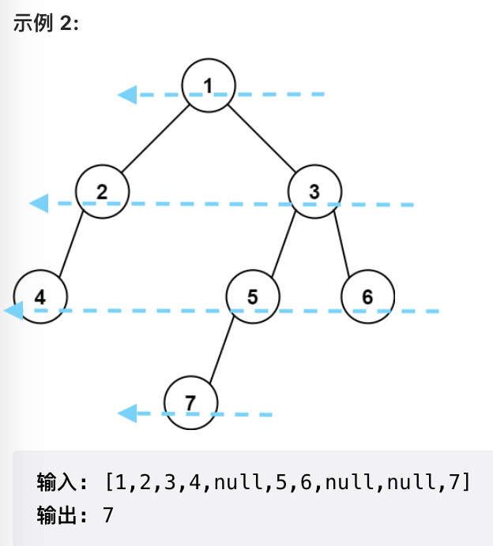
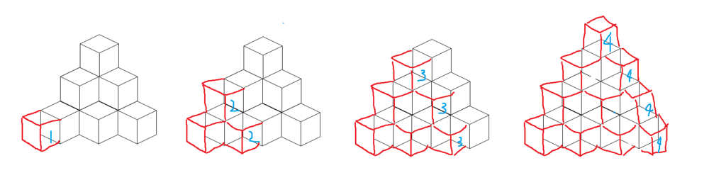

# 算法

## 一：语言

### 常用STL

#### vector

- `push_back(t)`
- `vector<int> ans`等价于`{1,2,3}`
- 创建
  - 长度为n的一维向量：`vector<int> v(n)`
  - 长度为nxm的二维向量：`vector<vector<int>> v(n, vector<int>(m))`


#### stack

- `top()`
- `push(t)`
- `pop()`

#### queue

- `front()`
- `back()`
- `push(t)`
- `pop()`

#### unordered_map

- 创建

```c++
unordered_map<string, string> m = {
	{"Key1", "Value1"},
	{"Key2", "Value2"},
	{"Key3", "Value3"}
};
m.emplace("Key4", "Value4");	//插入键值对
string s = m["Key4"];		//取值
m["Key5"] = "Value5";		//插入键值对
```

- 判断是否含有某个key

```c++
if(map.find(keyName) == map.end()){...}	//这个说明不在
```

- 取值

```c++
string s = m[key];	//如果key不存在，那么s为默认值
m2[key]++;	//如果value是int类型，支持自增，而且key不存在时默认为0，自增后存在
```


#### unordered_set

- 插入`insert()`
- 删除`erase()`
- 判断时候含有某个元素

```c++
if(set.find(item) == set.end()){...}	//说明不存在
```

#### ListNode

```c++
ListNode* node = new ListNode(0, head);
```

### 字符串

字符串也是一种stl，所以满足很多stl的性质，但又有很多单独的内容

#### 字符串插入字符

```c++
s.push_back(c);
```

#### sstream

```c++
stringstream ss;
string s;
ss << 100 << ' ' << 100;
ss >> s;	//此时s == "100 100"	
```

#### 遍历字符串

```c++
std::string str = "there is a test string";
//C++11
for(auto& c : str){
  do_things_with(c);
}
//迭代器
for(std::string::iterator it = str.begin(); it != str.end(); ++it){
  do_things_with(*it);
}
//传统方法
fot(std::string::size_type i = 0; i < str.size(); ++i){
  do_things_with(str[i]);
}
//由于string以null结尾，于是可以循环遍历
for(char* it = str; *it; ++it){
  do_things_with(*it);
}
```

####  

### 常用函数

- `sort(v.begin(), v.end())`

```c++
vector<string> l = {"aaa", "bb", "cccc", "z"};
//按字符串长度降序排列
sort(l.begin(), l.end(), [](const string& a, const string& b) -> bool {
  return a.size() > b.size();
});
```

- `to_string(i)`：int转string
- `stoi(s)`：string转int
- `memset(指向数组的指针, 要赋的值, sizeof(dis))`
- `rand()`：生成0到RAND_MAX范围内的随机数
  - `(rand() % (max - min)) + min`：生成[min, max)范围的int

## 二：数据结构

### 链表

#### 求中点

快慢指针

#### 反转链表

```c++
ListNode* reverseList(ListNode* head) {
        ListNode* prev = nullptr;
        ListNode* curr = head;
        while (curr) {
            ListNode* next = curr->next;
            curr->next = prev;
            prev = curr;
            curr = next;
        }
        return prev;
    }
```

#### 判断链表有无环

快慢指针，若相遇则有环

#### 寻找链表环的入口节点

我们设入口前有a个节点，环有b个节点

快慢指针第一次相遇时，慢指针走了s个节点，s=a+c（c为慢指针在环内走的长度）

快指针走了慢指针的两倍，走了f个节点，f=2s=a+c+nb（n不确定）

带入可得f=2nb

此时从起点x和相遇处y各放一个慢指针，当x走了a步时，**y相对于起点走了f+a=2nb+a步**，我们发现，在环里走nb步位置不变，于是此时y的位置就是a，由于x也在a处，于是两者相遇，而且是第二次相遇

于是我们只需要记录x走多少步会和y相遇，就能得到入口节点的位置

```c++
ListNode *detectCycle(ListNode *head) {
        ListNode* fast = head;
        ListNode* slow = head;
        while(1){
            if(fast == nullptr || fast->next == nullptr){
                return nullptr;
            }
            fast = fast->next->next;
            slow = slow->next;
            //快慢指针第一次相遇
            if(fast == slow){
                break;
            }
        }
        fast = head;
    	//寻找第二次相遇地点
        while(fast != slow){
            fast = fast->next;
            slow = slow->next;
        }
        return fast;
    }
```


### 字符串

#### split

（为啥C++没有这个？）

- 遍历字符串
  - 如果不是分割符，就添加到临时字符串中
  - 如果是分割符，那么将临时字符串放入数组，然后清空

```c++
auto split = [](const string& s, char delim) -> vector<string> {
        vector<string> ans;
        string cur;
        for (char ch: s) {
            if (ch == delim) {
                ans.push_back(move(cur));
                cur.clear();
            }
            else {
                cur += ch;
            }
        }
        ans.push_back(move(cur));
        return ans;
    };
vector<string> names = split(path, '/');
```

#### substr

有的时候输入是以`xxx,xxx`的形式，我们可以

```c++
cin >> str;
a = str.substr(0, str.find(','));
b = str.substr(str.find(',')+1, str.size());
```

### 栈

#### 移除无效括号

```
给你一个由 '('、')' 和小写字母组成的字符串 s。
你需要从字符串中删除最少数目的 '(' 或者 ')' （可以删除任意位置的括号)，使得剩下的「括号字符串」有效。

请返回任意一个合法字符串。
```

```c++
class Solution {
public:
    string minRemoveToMakeValid(string s) {
        stack<int> st;
        int len = s.size();
        for(int i = 0; i < len; ++i){
            if(s[i] == '(' || s[i] == ')'){
                if(s[i] == '('){
                    st.push(i);
                }
                else if(st.empty()){
                    //当出现了一个非法的')'时
                    s.erase(i, 1);
                    --len;
                    --i;
                }
                else{
                    //当出现了一个合法的')'时
                    st.pop();
                }
            }
        }
        //倘若最后省了几个左括号，那么这些左括号就非法
        while(!st.empty()){
            int v = st.top();
            st.pop();
            s.erase(v, 1);
        }
        return s;
    }
};
```


### 单调栈

#### 最大内接矩形（单调递增栈）

题目略

如果我们从左向右，发现矩形一直是递增的，直到第$i$个矩形（蓝色），于是得到一下几个候选矩形，分别计算三个矩形的面积


求完面积后，蓝色向右移动，在移动之前，先进行**削峰**


我们发现，蓝色左边的矩形，就算以后遍历的时候被用到，参与计算的高度最多也只是这个蓝色矩形的高度，那么我们就直接把左边的高度改成蓝色矩形的高度，然后我们惊奇的发现，削峰后，左边的矩形又恢复递增了

于是问题变成

- 从左向右遍历
  - 如果`h(i) >= h(i-1)`，那么将`i`加入递增矩形中
  - 否则，将`i`设为右边界，计算左边每个候选矩阵的面积
    - 将左边每个矩阵进行削峰，将`i`加入递增矩形中

于是问题变成了一个维护递增矩形的问题，可以用单调栈来实现

- 从左向右遍历
  - 如果`s.empty() || s.top() < h[i]`，入栈
  - 否则，循环遍历栈顶元素
    - 如果`s.top() >= h[i]`，栈顶出栈，计算面积
      - 若面积大于当前最大面积，则更新最大面积
      - `ans = max(ans, (i - s.top()) * h[s.top()])`
    - 将最后一次出栈顶元素入栈，并削峰`s.top() = h[i]`

```c++
class Solution {
public:
    int largestRectangleArea(vector<int>& heights) {
        heights.push_back(-1);	//以防数组单增
        stack<int> st;  //单调递增栈，栈中存储的是元素的id
        int ans = 0;
        int topIndex = 0;   //如果要维持单增，栈顶元素的（最左）位置
        int len = heights.size();
        for(int i = 0 ; i < len; i++){
            if(st.empty() || heights[st.top()] < heights[i]){
                st.push(i);    //单增则入栈
            }
            else{
                while(!st.empty() && heights[st.top()] >= heights[i]){
                    //如果h[i]比栈顶小，那么一直出栈，直到恢复为单增（空也是单增）
                    topIndex = st.top();
                    st.pop();
                    ans = max(ans, (i - topIndex) * heights[topIndex]);
                }
                st.push(topIndex);
                heights[topIndex] = heights[i]; //削峰
            }
        }
        return ans;
    }
};
```

#### 接雨水（单调递减栈）


```c++
class Solution {
public:
    int trap(vector<int>& height) {
        int ans = 0;
        stack<int> stk;
        int n = height.size();
        for (int i = 0; i < n; ++i) {
            while (!stk.empty() && height[i] > height[stk.top()]) {
                int top = stk.top();
                stk.pop();
                if (stk.empty()) {
                    break;
                }
                int left = stk.top();
                int currWidth = i - left - 1;
                int currHeight = min(height[left], height[i]) - height[top];
                ans += currWidth * currHeight;
            }
            stk.push(i);
        }
        return ans;
    }
};
```


### 图论

#### 颜色渲染

泛洪，广度优先搜索

```c++
class Solution {
public:
    const int dx[4] = {1, 0, 0, -1};
    const int dy[4] = {0, 1, -1, 0};
    vector<vector<int>> floodFill(vector<vector<int>>& image, int sr, int sc, int newColor) {
        int currColor = image[sr][sc];
        if (currColor == newColor) return image;
        int n = image.size(), m = image[0].size();
        queue<pair<int, int>> que;
        que.emplace(sr, sc);
        image[sr][sc] = newColor;
        while (!que.empty()) {
            int x = que.front().first, y = que.front().second;
            que.pop();
            for (int i = 0; i < 4; i++) {
                int mx = x + dx[i], my = y + dy[i];
                if (mx >= 0 && mx < n && my >= 0 && my < m && image[mx][my] == currColor) {
                    que.emplace(mx, my);
                    image[mx][my] = newColor;
                }
            }
        }
        return image;
    }
};

```

#### 岛屿问题

本质就是遍历图上每一个点，遇到一个符合条件的，通过深搜将所有相邻的点进行标记

##### 被围绕的区域

```
给你一个 m x n 的矩阵 board ，由若干字符 'X' 和 'O' ，找到所有被 'X' 围绕的区域，并将这些区域里所有的 'O' 用 'X' 填充。
```

```C++
class Solution {
public:
    void solve(vector<vector<char>>& board) {
        int lenX = board.size();
        int lenY = board[0].size();
        for(int i = 0; i < lenX; i++){
            for(int j = 0; j < lenY; j++){
                //从边缘开始
                bool isEdge = i == 0 || j == 0 || i == lenX-1 || j == lenY -1;
                if(isEdge && board[i][j] == 'O'){
                    dfs(i, j, board);
                }
            }
        }
        for(int i = 0; i < lenX; i++){
            for(int j = 0; j < lenY; j++){
                if(board[i][j] == 'O'){
                    board[i][j] = 'X';
                }
                else if(board[i][j] == '#'){
                    board[i][j] = 'O';
                }
            }
        }
    }
    void dfs(int x, int y, vector<vector<char>> & board){
        if(x < 0 || y < 0 || x >= board.size() || y >= board[0].size()){
            return;		//越界
        }
        if(board[x][y] == 'X' || board[x][y] == '#'){
            return;		//若不符合条件 || 已经访问过
        }
        board[x][y] = '#';
        dfs(x-1, y, board);
        dfs(x+1, y, board);
        dfs(x, y-1, board);
        dfs(x, y+1, board);
    }
};
```

##### 岛屿数量

```
请你计算二维网格中岛屿的数量。
```

- 遍历网格
  - 找到一个陆地，`ans++`
  - 将这个陆地相邻的陆地（1）全变成海洋（0）

##### 岛屿最大面积

```
请你计算二维网格中岛屿的最大面积
```

- 遍历网格
  - 找到一个陆地
  - 深搜所有与之相邻的陆地，得到面积`v`
  - `max = v > max ? v : max`

##### 封闭岛屿的数量

```
上下左右都是水的到被称为封闭岛屿，问封闭岛屿的数量
```

什么样的岛不是封闭岛屿呢？与边界有接壤的就不封闭了

#### 拓扑排序

对于一个有向无环图（DAG），我们能得到一个（或多个）线性排序，使得对于从顶点u到顶点v的每个有向边uv，u 在排序中都在v之前

拓扑排序的解法为：

1. 找到一个入度为0的节点作为起点，删除以该点为起点的边
2. 重复1，直到图为空
3. 若图不为空，则说明图不是DAG

```
课程顺序：
现在总共有 numCourses 门课需要选，记为 0 到 numCourses-1。

给定一个数组 prerequisites ，它的每一个元素 prerequisites[i] 表示两门课程之间的先修顺序。 例如 prerequisites[i] = [ai, bi] 表示想要学习课程 ai ，需要先完成课程 bi 。

请根据给出的总课程数  numCourses 和表示先修顺序的 prerequisites 得出一个可行的修课序列。

可能会有多个正确的顺序，只要任意返回一种就可以了。如果不可能完成所有课程，返回一个空数组。
```

```c++
class Solution {
public:
    vector<int> findOrder(int numCourses, vector<vector<int>>& prerequisites) {
      	//构建图，key为课程名，value为该课程的后置课程（的数组），实际描述了[ai, bi]
        unordered_map<int, vector<int>> graph;
      	//存储了某课程的入度
        vector<int> inDegress(numCourses, 0);
        for (auto& pre : prerequisites) {
            graph[pre[1]].push_back(pre[0]);
            inDegress[pre[0]]++;
        }

        vector<int> ret;
      	//存储所有入度为0的课程
        queue<int> que;
        for (int i = 0; i < inDegress.size(); ++i) {
            if (inDegress[i] == 0) {
                que.push(i);
            }
        }
        //找到并删除所有入度为0的课程，将删除的内容存储在数组中
        while (!que.empty()) {
            int node = que.front();
            que.pop();
            ret.push_back(node);
          	//删除该课程后，该课程的所有后置课程入度-1，并重新统计所有入度为0的课程
            for (auto& n : graph[node]) {
                inDegress[n]--;
                if (inDegress[n] == 0) {
                    que.push(n);
                }
            }
        }
				//若最后没删干净，被删除的课程数量!=总课程数量，则返回空
        if (ret.size() != numCourses) {
            return {};
        }       
        return ret;
    }
};

```

#### 最长递增路径

记忆化搜索（深度优先）或者拓扑排序

```
给定一个 m x n 整数矩阵 matrix ，找出其中 最长递增路径 的长度。
注意！路径是 a>b，不必考虑 a==b 的情况

对于每个单元格，你可以往上，下，左，右四个方向移动。 不能 在 对角线 方向上移动或移动到 边界外（即不允许环绕）。
```

记忆化搜索：类似于动态规划的思想，搜索过程具有**无后效性**，从某点开始的搜索结果仅与该点状态有关，而与如何来到该点、来该点前做了什么无关。于是当我们再次搜到该点，就可以直接利用以上次的搜索结果

```c++
class Solution {
public:
    static constexpr int dirs[4][2] = {{-1, 0}, {1, 0}, {0, -1}, {0, 1}};
    int rows, columns;

    int longestIncreasingPath(vector< vector<int> > &matrix) {
        if (matrix.size() == 0 || matrix[0].size() == 0) {
            return 0;
        }
        rows = matrix.size();
        columns = matrix[0].size();
      	//记录从(i, j)节点出发最长递增路径长度
        auto memo = vector< vector<int> > (rows, vector <int> (columns));
        int ans = 0;
        for (int i = 0; i < rows; ++i) {
            for (int j = 0; j < columns; ++j) {
              	//从(i, j)节点出发
                ans = max(ans, dfs(matrix, i, j, memo));
            }
        }
        return ans;
    }

    int dfs(vector< vector<int> > &matrix, int row, int column, vector< vector<int> > &memo) {
      	//若该点memo不等于0，则说明该节点已经被搜索过了，直接使用历史结果
        if (memo[row][column] != 0) {
            return memo[row][column];
        }
      	//该点meno赋值为1，意思为如果周围四个方向都不能走，这是个死路，那么就只能走这一步
        ++memo[row][column];
        for (int i = 0; i < 4; ++i) {
          	//新位置
            int newRow = row + dirs[i][0], newColumn = column + dirs[i][1];
          	//若新位置不出界 且 递增（这题简单在不用考虑相等，于是不会再转回来，反复横跳）
            if (newRow >= 0 && newRow < rows && newColumn >= 0 && newColumn < columns && matrix[newRow][newColumn] > matrix[row][column]) {
              	//继续深搜
                memo[row][column] = max(memo[row][column], dfs(matrix, newRow, newColumn, memo) + 1);
            }
        }
        return memo[row][column];
    }
};
```

拓扑排序，从出度为0的节点出发进行广度优先搜索，每轮搜索遍历当前层所有单元格，更新出度，若出度为0，则加入下一层搜索，最后搜索的总层数就是最长路径长度

```c++
class Solution {
public:
    static constexpr int dirs[4][2] = {{-1, 0}, {1, 0}, {0, -1}, {0, 1}};
    int rows, columns;

    int longestIncreasingPath(vector< vector<int> > &matrix) {
        if (matrix.size() == 0 || matrix[0].size() == 0) {
            return 0;
        }
        rows = matrix.size();
        columns = matrix[0].size();
        auto outdegrees = vector< vector<int> > (rows, vector <int> (columns));
      	//统计出度
        for (int i = 0; i < rows; ++i) {
            for (int j = 0; j < columns; ++j) {
                for (int k = 0; k < 4; ++k) {
                    int newRow = i + dirs[k][0], newColumn = j + dirs[k][1];
                    if (newRow >= 0 && newRow < rows && newColumn >= 0 && newColumn < columns && matrix[newRow][newColumn] > matrix[i][j]) {
                        ++outdegrees[i][j];
                    }
                }
            }
        }
      	//将所有出度为0的节点加入队列
        queue < pair<int, int> > q;
        for (int i = 0; i < rows; ++i) {
            for (int j = 0; j < columns; ++j) {
                if (outdegrees[i][j] == 0) {
                    q.push({i, j});
                }
            }
        }
        int ans = 0;
      	//广搜
        while (!q.empty()) {
            ++ans;
            int size = q.size();
            for (int i = 0; i < size; ++i) {
                auto cell = q.front(); q.pop();
                int row = cell.first, column = cell.second;
                for (int k = 0; k < 4; ++k) {
                    int newRow = row + dirs[k][0], newColumn = column + dirs[k][1];
                    if (newRow >= 0 && newRow < rows && newColumn >= 0 && newColumn < columns && matrix[newRow][newColumn] < matrix[row][column]) {
                        --outdegrees[newRow][newColumn];
                        if (outdegrees[newRow][newColumn] == 0) {
                            q.push({newRow, newColumn});
                        }
                    }
                }
            }
        }
        return ans;
    }
};
```


### 哈希表

#### 转化为罗马数字

`unordered_map`顾名思义是无顺序的，这题要求有顺序的哈希表，C++中可以通过键值对数组来实现

```c++
const pair<int, string> valueSymbols[] = {
    {1000, "M"},
    {900,  "CM"},
    {500,  "D"},
    {400,  "CD"},
    {100,  "C"},
    {90,   "XC"},
    {50,   "L"},
    {40,   "XL"},
    {10,   "X"},
    {9,    "IX"},
    {5,    "V"},
    {4,    "IV"},
    {1,    "I"},
};

class Solution {
public:
    string intToRoman(int num) {
        string roman;
        for (const auto &[value, symbol] : valueSymbols) {
            while (num >= value) {
                num -= value;
                roman += symbol;
            }
            if (num == 0) {
                break;
            }
        }
        return roman;
    }
};
```

#### hash函数的实现

哈希函数是将任意长度的输入，转化为固定长度的输出，该输出值就是hashcode

- 加法hash

```js
function hashFunc(str, max) {
    var hashCode = 0
    // 霍纳算法, 来计算hashCode的数值
    for (var i = 0; i < str.length; i++) {
        // 37是一个质数
        hashCode = 37 * hashCode + str.charCodeAt(i)
    }
    // 取模运算
    hashCode = hashCode % max
    return hashCode
}
```

- 位运算hash

```js
for (var i = 0; i < str.length; i++) {
    hashCode = (hashCode << 4) ^ (hashCode >> 28) ^ str.charCodeAt(i)
}
```

- 乘法hash

- 除法hash
- 查表hash
- 混合hash

### 二叉树

#### 前序+中序构建二叉树

```c++
class Solution {
public:
    unordered_map<int, int> valueToId;	//方便查找中序遍历中某数的位置

    TreeNode* build(const vector<int>& preorder, const vector<int>& inorder, int pBegin, int pEnd, int iBegin, int iEnd){
        if(pBegin > pEnd){
            return nullptr;
        }
        int pRootId = pBegin;	//根节点就是前序遍历第一个数
        int iRootId = valueToId[preorder[pRootId]];

        TreeNode* root = new TreeNode(preorder[pRootId]);

        int leftSize = iRootId - iBegin;	
        root->left = build(preorder, inorder, pBegin+1, pBegin+leftSize, iBegin, iRootId-1);
        root->right = build(preorder, inorder, pBegin+leftSize+1, pEnd, iRootId+1, iEnd);
        return root;
    }
    
    TreeNode* buildTree(vector<int>& preorder, vector<int>& inorder) {
        int n = preorder.size();
        for(int i = 0; i < n; ++i){
            valueToId[inorder[i]] = i;
        }
        return build(preorder, inorder, 0, n-1, 0, n-1);
    }
};
```


#### 二叉树的最大深度

```c++
int dfs(TreeNode* node){
    if(node == nullptr){
      	return 0;
    }
    int L = dfs(node->left);
    int R = dfs(node->right);
    return max(L, R) + 1;
}
```

#### 二叉树的直径

```
给定一棵二叉树，你需要计算它的直径长度。一棵二叉树的直径长度是任意两个结点路径长度中的最大值。这条路径可能穿过也可能不穿过根结点。
```

直径=某点左右子树最大深度和-1

```c++
int ans;
int dfs(TreeNode* rt){
    if (rt == nullptr) {
      	return 0; 
    }
    int L = dfs(rt->left);
    int R = dfs(rt->right); 
    ans = max(ans, L + R + 1); // 计算d_node即L+R+1 并更新ans
    return max(L, R) + 1; 
}
```


### 二叉搜索树

二叉搜索树的重要性质

- 中序遍历为升序
- 两子树仍为二叉搜索树，并且分布在中间的两部分

#### 有序数组构建二叉搜索树

*仅由中序遍历得到的树不唯一*

```
给你一个整数数组 nums ，其中元素已经按 升序 排列，请你将其转换为一棵 高度平衡 二叉搜索树。

高度平衡 二叉树是一棵满足「每个节点的左右两个子树的高度差的绝对值不超过 1 」的二叉树。
```

从中间开始构建，得到的二叉搜索树就是平衡的

```c++
class Solution {
public:
    TreeNode* sortedArrayToBST(vector<int>& nums) {
        return build(0, nums.size()-1, nums);
    }

    TreeNode* build(int left, int right, vector<int>& nums){
        if(left > right){
            return nullptr;
        }
        int mid = (left + right) /2;
        TreeNode* node = new TreeNode(nums[mid]);
        node->left = build(left, mid-1, nums);
        node->right = build(mid+1, right, nums);
        return node;
    }
};
```

#### 让二叉搜索树变平衡

这道题并不是一道AVL，因为初始树树二叉搜索树，我们只需要两步

1. 中序遍历，得到有序数组
2. 通过有序数组构树

### 堆

#### 堆排序

### 并查集

是一种用于描述不相交集合的数据结构，核心就是查询与合并

## 三：算法

### 动态规划

不考虑优化的情况下，就是从1开始，一直记录、遍历到n，最后输出n

一般情况下，从1到n完全遍历，比递归性能要好

#### 打家劫舍

```
每个房子都有钱，但是你不能拿相邻屋子的钱，如何能拿到最多的钱？
```

- 每个房子都有两个状态，拿与不拿，`dp[i-1][0]`表示第`i`家如果不拿，最多拿的钱
- 对于第一个房子

```c++
dp[0][0] = 0;
dp[0][1] = num[0];
```

- 对于第`i`个房子，
  - 如果拿，那么第`i-1`家肯定就没法拿，那么拿的钱就是前一家不拿+这一家的钱
  - 如果不拿，那么第`i-1`家可以选择拿，也可以选择不拿，看看哪一个钱更多

```c++
dp[i][1] = dp[i-1][0] + num[i];
dp[i][0] = max(dp[i-1][0], dp[i-1][1]);
```

#### 括号生成

```
数字 n 代表生成括号的对数，请你设计一个函数，用于能够生成所有可能的并且有效的括号组合
```

- 当`n==1`时，只可能为`()`
- 有效的字符串最左边一定是一个`(`，并且能在右边找到一个`)`与之对应
  - 那么就变成`(p)q`的形式，p和q都是有效的括号组合，并且p+q+1==n

```c++
vector<string> generateParenthesis(int n) {
  if(n == 0) return {};
  if(n == 1) return {"()"};
  //dp[i]表示括号对数为i的，所有有效的可能括号组合
  vector<vector<string>> dp(n+1);
  dp[0] = {""};
  dp[1] = {"()"};
  //括号对数
  for(int i = 2; i <= n; i++){
    //左边的括号数
    for(int j = 0; j < i; j++){
      //右边的括号数
      int k = i - j -1;
      for(int x = 0; x < dp[j].size(); x++){
        for(int y = 0; y < dp[k].size(); y++){
          string str = "(" + dp[j][x] + ")" + dp[k][y];
          dp[i].push_back(str);
        }
      }
    }
  }
  return dp[n];
}
```

#### 完全背包

```
给你一个整数数组 coins 表示不同面额的硬币，另给一个整数 amount 表示总金额。
请你计算并返回可以凑成总金额的硬币组合数。如果任何硬币组合都无法凑出总金额，返回 0 。

假设每一种面额的硬币有无限个。 
```

这是一道完全背包问题

```c++
class Solution {
public:
    int change(int amount, vector<int>& coins) {
        vector<int> dp(amount + 1);
        dp[0] = 1;
        for (int& coin : coins) {
            for (int i = coin; i <= amount; i++) {
                dp[i] += dp[i - coin];
            }
        }
        return dp[amount];
    }
};
```

#### 编辑距离

```
你可以对一个字符串做三种操作
- 删掉一个字符
- 增加一个字符
- 替换一个字符
请问现在给你两个字符串，问最少用几次操作，使两个字符串相等
```

比如字符串`ACT`和`AGCT`，我们可以画一个表

```c++
  @ A G C T
@ 0 1 2 3 4		//这一行的意思为：若从空字符串开始，要想变成AGCT的前n位，需要多少步
A 1 0 1 2 3
C 2 1 1 1 2
T 3 2 2 2 1		//最右下角的意思为：从ACT开始，变成AGCT需要多少步
```

```c++
int solve(string s1, string s2) {
    int n = s1.length();
    int m = s2.length();
    vector<vector<int>> dp(n + 1, vector<int>(m + 1, 0));
    for (int i = 1; i <= n; i++)
        dp[i][0] = i;
    for (int j = 1; j <= m; j++)
        dp[0][j] = j;
    for (int i = 1; i <= n; i++) {
        for (int j = 1; j <= m; j++) {
            if (s1[i - 1] == s2[j - 1])		//若两个字符相同，那么操作次数增加0
                dp[i][j] = dp[i - 1][j - 1];
            else
                dp[i][j] = min({
                    dp[i - 1][j] + 1,
                    dp[i][j - 1] + 1,
                    dp[i - 1][j - 1] + 1
                });
        }
    }
    return dp[n][m];
}
```

#### 翻转字符

```
给定一个只有01构成的字符串，我们可以将某一个字符从0翻转为1，或者从1翻转为0。请问至少要翻转多少次，才能使得新字符串是单调递增的
单调递增，000111是递增，1111是递增，0000是递增，0100不是递增
```

我们设定一个二维数组，`v[i][0]`的意思为前`i`个元素组成的字符串以0结尾，至少需要翻转多少下

```c++
int minFlipsMonoIncr(string s) {
        int n = s.size();
        vector<vector<int>> v(n, vector<int>(2));    //以0/1结尾需要的步数
        if(s[0] == '0'){
            v[0][0] = 0;
            v[0][1] = 1;
        }
        else{
            v[0][0] = 1;
            v[0][1] = 0;
        }
        for(int i = 1; i < n; ++i){
            if(s[i] == '0'){
                //抽到0，以0结尾，不需要翻转
                v[i][0] = v[i-1][0];
                //抽到0，以1结尾
                // - 前面全0，这个翻为1
                // - 前面以1结尾，这个翻为1
                v[i][1] = min(v[i-1][0]+1, v[i-1][1]+1);
            }
            else{
                //抽到1，以0结尾，这个翻为0
                v[i][0] = v[i-1][0]+1;
                //抽到1，以1结尾
                // - 前面全0，不需要翻
                // - 前面以1结尾，不需要翻
                v[i][1] = min(v[i-1][0], v[i-1][1]);
            }
        }
        return min(v[n-1][0], v[n-1][1]);
    }
```


### 搜索

搜索的原理就是枚举，枚举所有可能，找出可行解/最优解

#### 深度优先

- 常用于求可行解

```c++
void dfs(int curr){
  if(visit[curr]){	//只访问未曾访问过的节点
    return;
  }
	visit[curr] = true;	//将该点设为已访问
  f(curr);	//使用当前节点，比如添加到ans中
  for(int i = 0; i <= MAX; i++){	//遍历所有可能与curr相连的点
    int val = i;
    if(adj[curr][val]){	//adj[][]是图的邻接矩阵，用于判断该点是否与curr相连
      dfs(val);
    }
  }
}
```

#### 广度优先

- 常用于求最优解

- 常用队列/哈希表来维护
- 本质就是暴力枚举

bfs遍历图：

```c++
const int inf = -1;

void bfs(int curr){
  queue<int> q;
  memset(dis, inf, sizeof(dis));	//将初始字符串全设为-1
  dis[curr] = 0;	//自己和自己的距离为0
  q.push(curr);		//第一个元素入队
  while(!q.empty()){	
    int i = q.front();
    q.pop();
    for(int j = 1; j <= MAX; j++){
      if(!adj[i][j]) continue;		//如果这两个节点不连通，就跳过
      if(dis[j] != inf) continue;	//如果这个节点已经被访问过，就不再访问（状态哈希）
      dis[j] = dis[i] + 1;
      q.push(j);
    }
  }
}
```

#### 二叉树最底层最左边的值

```
给定一个二叉树的 根节点 root，请找出该二叉树的 最底层 最左边 节点的值。
假设二叉树中至少有一个节点。
```



本质就是层序遍历树，我们广度优先遍历树，顺序为：中间--右--左，这样就可以保证如上图蓝色箭头方向遍历树，最后一个元素就是最下最左

```c++
int findBottomLeftValue(TreeNode* root) {
        queue<TreeNode*> q;
        q.push(root);
        int ans;
        while(!q.empty()){
            auto a = q.front();
            q.pop();
            if(a->right){
                q.push(a->right);
            }
            if(a->left){
                q.push(a->left);
            }
            ans = a->val;
        }
        return ans;
    }
```


### 双指针

#### 三数之和

```
给你一个包含 n 个整数的数组 nums，判断 nums 中是否存在三个元素 a，b，c ，使得 a + b + c = 0 ？请你找出所有和为 0 且不重复的三元组。
```

- 若nums为空或者nums长度小于3，无解
- 否则，对数组排序后遍历
  - 若`nums[i] > 0`，那么其后面的数不可能与`i`组成解，遍历结束
  - 左指针`L = i+1`，右指针`R = n-1`，若`L < R`
    - 若三数之和为0，记录结果，并左右移
    - 若大于0，R左移
    - 若小于0，L右移

#### 盛最多水的容器

```
给定一个长度为 n 的整数数组 height 。有 n 条垂线，第 i 条线的两个端点是 (i, 0) 和 (i, height[i]) 。
找出其中的两条线，使得它们与 x 轴共同构成的容器可以容纳最多的水。
返回容器可以储存的最大水量。

说明：你不能倾斜容器。
```

```c++
class Solution {
public:
    int maxArea(vector<int>& height) {
        int i = 0, j = height.size() - 1, res = 0;
        while(i < j) {
            res = height[i] < height[j] ? 
                max(res, (j - i) * height[i++]): 
                max(res, (j - i) * height[j--]); 
        }
        return res;
    }
};
```

#### 一次编辑

```
字符串有三种编辑操作:插入一个英文字符、删除一个英文字符或者替换一个英文字符。 给定两个字符串，编写一个函数判定它们是否只需要一次(或者零次)编辑。
```

1. 判断两个字符串长度差是否大于1
2. 从0开始遍历两个字符串，并设置一次纠错机会
3. 若`str1[i] != str2[j]`
   1. 若已经纠错过，那么false
   2. 若没纠错过，用掉纠错机会
      1. 若两字符串一样长，`i++ j++`
      2. 不一样长，则长的那个index++
   3. `i++ j++`

### 二分查找

#### 搜索旋转排序数组

```
[0,1,2,3,4,5,6,7]在下标3处旋转，变为[3,4,5,6,7,0,1,2]
请从一个旋转数组中查找target的位置，若不存在则返回-1
```

```c++
class Solution {
public:
    int search(vector<int>& nums, int target) {
        int n = (int)nums.size();
        if (!n) {
            return -1;
        }
        if (n == 1) {
            return nums[0] == target ? 0 : -1;
        }
        int l = 0, r = n - 1;
        while (l <= r) {
            int mid = (l + r) / 2;
            if (nums[mid] == target) return mid;
            if (nums[0] <= nums[mid]) {
                if (nums[0] <= target && target < nums[mid]) {
                    r = mid - 1;
                } else {
                    l = mid + 1;
                }
            } else {
                if (nums[mid] < target && target <= nums[n - 1]) {
                    l = mid + 1;
                } else {
                    r = mid - 1;
                }
            }
        }
        return -1;
    }
};
```


### 回溯

#### 排列

```c++
vector<string> ans;
bool use[10];		//辅助数组，用于判断是否被用过
void backtrace(int cur, int total, string& temp){
  //边界条件
  if(cur == total){
    ans.push_back(temp);
    return;
  }
  for(int i = 0; i < total; i++){
    if(use[i]){
      continue;
    }
    //找到一个没有被用过的数据
    use[i] = true;	//类似于锁，告诉从这里发出的回溯，这个数据被占用了
    temp.push_back(c[i]);		//使用这个数据
    backtrace(cur+1, total, temp);	//向后追一下
    temp.pop_back();	//将这个数据回溯
    use[i] = false;	//解锁
  }
}
```

#### 组合

```c++
vector<vector<int>> ans;
void backtrace(int begin ,int n, vector<int> & temp, vector<int>& can){
    if(n == 0){
        ans.push_back(temp);
        return;
    }
    for(int i = begin; i < can.size(); i++){
        if(n < can[i]){
            continue;
        }
        temp.push_back(can[i]);
        backtrace(i, n-can[i], temp, can);
        temp.pop_back();
    }
}
```

begin的作用是按顺序遍历，我们假定**组合数是递增**的，那么第一个为2的所有组合都在2那个分支，其余分支都不能从2开始，不然那个分支就成为2那个分支的一部分了


### 滑动窗口

#### 无重复字符的最长子串

用set维护一个滑动窗口

```c++
class Solution {
public:
    int lengthOfLongestSubstring(string s) {
        unordered_set<char> cs;
        int left = 0;
        int len = 0;
        int maxLen = 0;
        for(int i = 0; i < s.size(); i++){
            if(cs.find(s[i]) == cs.end()){
                cs.insert(s[i]);
                len++;
                if(len > maxLen){
                    maxLen = len;
                }
            }
            else{
                while(s[left] != s[i]){
                    cs.erase(s[left]);
                    left++;
                    len--;
                }
                left++;
            }
        }
        return maxLen;
    }
};
```

### 贪心

#### 分发糖果

```
n 个孩子站成一排。给你一个整数数组 ratings 表示每个孩子的评分。
你需要按照以下要求，给这些孩子分发糖果：
- 每个孩子至少分配到 1 个糖果。
- 相邻两个孩子评分更高的孩子会获得更多的糖果。

请你给每个孩子分发糖果，计算并返回需要准备的 最少糖果数目 。
```

思想就是，来回比一圈，比赢一次就加一个糖，比输了，就只能得到1个糖

- 从左向右遍历
  - 第一个小孩给1个糖
  - 如果一个小孩等级比他左手的小孩高`ratings[i] > ratings[i - 1])`
    - 那么给他`a[i - 1] + 1`
    - 否则给1个
- 从右向左遍历
  - 最右边的小孩给1个糖
  - 如果一个小孩等级比他右手的小孩等级高
    - 那么给他`b[i + 1] + 1`
    - 否则给1个糖（覆盖掉）

为什么左一次右一次不会破坏规则呢？假设AB相邻（A在左），A的rate比B大，那么

- 左规则后，A >= B == 1
- 右规则后，A > B
- 两次取最大值，A >= B

```c++
class Solution {
public:
    int candy(vector<int>& ratings) {
        int len  = ratings.size();
        vector<int> a(len, 0);
        vector<int> b(len, 0);
        for(int i = 0; i < len; i++){
            if(i > 0 && ratings[i] > ratings[i-1]){
                a[i] = a[i-1]+1;
            }
            else{
                a[i] = 1;
            }
        }
        for(int i = len-1; i >= 0; i--){
            if(i < len-1 && ratings[i] > ratings[i+1]){
                b[i] = b[i+1]+1;
            }
            else{
                b[i] = 1;
            }
        }
        int ans = 0;
        for(int i = 0; i < len; i++){
            ans += max(a[i], b[i]);
        }
        return ans;
    }
};
```

#### 放置盒子

```
有一个立方体房间，其长度、宽度和高度都等于 n 个单位。请你在房间里放置 n 个盒子，每个盒子都是一个单位边长的立方体。放置规则如下：
- 你可以把盒子放在地板上的任何地方。
- 如果盒子 x 需要放置在盒子 y 的顶部，那么盒子 y 竖直的四个侧面都 必须 与另一个盒子或墙相邻。
给你一个整数 n ，返回接触地面的盒子的 最少 可能数量。
```

思路：比如我们现在已经摆了10个盒子，最好的摆法是下图最左边黑色部分，如果我们想要再加一个盒子，必须放在地上，于是我们按图中所示摆放

如果我们再像摆放一个，还要放在地上（下图左2）。好消息是，由于我们这两个摆放，第三个盒子不用放在地上了

通过观察，我们发现，对于一堆“完美”的盒子，我们想让接地盒子数量+1，每次需要的盒子数量始终为

`1+2+3+4+...+n`，其中



```c++
int minimumBoxes(int n){
    int cur = 0;	//当前一共摆放了cur个盒子
    int i = 0;	//新摆了多少个盒子
    int j = 0;	//当前一截面能容纳多少个盒子
    while(cur < n){
        ++j;	//一个截面能容纳 1,2,3,..,n
        i += j;	
        cur += i;
    }
    //于是我们得到了最多多少个截面
    if(cur == n){
        return i;	//这里利用了对称性，如果是完美摆放，那么-z面和-x面盒子数一样
    }
    //这一步就是上图的红色部分，在一个完美摆放上方i
    cur -= i;	//减去i，就是完美摆放
    i -= j;
    j = 0;
    while(cur < n) {
        ++j;
        cur += j;
    }
	return i+j;
}
```

### 前缀和

#### 带有负数的前缀和

```
给定一个整数数组和一个整数 k ，请找到该数组中和为 k 的连续子数组的个数
其中数组元素范围为[-1000, 1000]
```

传统前缀和元素都是非负数，因此前缀和是单调递增的，于是只要双指针遍历，找到等于k的数组，就可以中断这一轮右指针遍历，让左指针向右移动一次。

但是现在数组中有负数，因此右指针必须全部遍历，才能得到完整结果，这样性能太差了

我们仔细观察前缀和找k的公式

```
ps[j] - ps[i] == k
```

我们其实可以转化为

```
ps[i] == ps[j] - k
```

于是我们只需要遍历一次前缀和，对于`j`，我们去找前缀和为`ps[j]-k`的数量

```c++
int subarraySum(vector<int>& nums, int k) {
        int n = nums.size();
        vector<int> ps(n+1, 0);
        unordered_map<int, int> mp; //key为前缀和，value为前缀和已经出现了多少次
        mp[0] = 1;
        for(int i = 0; i < n; ++i){
            ps[i+1] = ps[i] + nums[i];
            //++mp[ps[i+1]];这样是错误的
        }
        int ans = 0;
        for(int j = 1; j <= n; ++j){
            ans += mp[ps[j]-k];
            ++mp[ps[j]];
        }
        return ans;
    }
```

注意，我们这里把` ++mp[ps[j]]`放在了下面，这件事的本质上`mp[ps[j]-k]`是从`j`开始向左找，看看能不能找到一个`i`，能让`i~j`和为`k`

因此在遍历完`j`之前，`ps[j]`还没出现（当然会有数值相等的，但是意义不同），因此要在遍历后再++

#### 配合哈希表

```
一个数组仅由1和-1组成，请找到含有相同数量的-1、1的最长连续子数组，输出子数组长度
```

这道题一看就可以用哈希表+双指针，结果复杂度过高，超时了

```c++
int findMaxLength(vector<int>& nums) {
        int n = nums.size();
        vector<int> pres(n+1);
        pres[0] = 0;
        for(int i = 1; i <= n; ++i){
            pres[i] = pres[i-1] + (nums[i-1] == 0 ? -1 : 1);
        }
        int m = 0;
        for(int i = 0; i <= n; ++i){
            for(int j = i+1; j <= n; ++j){
                if(pres[j] == pres[i] && j-i > m){
                    m = j-i;
                }
            }
        }
        return m;   
    }
```

可以使用哈希表加速

```c++
unordered_map<int, int> mp;
mp.emplace(0, 0);
// 从1开始遍历
for (int i = 1; i <= n; i++) {
  int tar = pres[i]; // 这是要找的和
  if (mp.count(tar)) m = max(m, i - mp[tar]);
  else mp.emplace(tar, i);	//我们只记录第一次出现的index，因为再次出现的长度一定更小
}
```


## 四：设计

#### 比特位计数

```
求一个整数x的二进制中，1的个数
```

```c++
int countOnes(int x) {
    int ones = 0;
    while (x > 0) {
        x &= (x - 1);
        ones++;
    }
    return ones;
}
```

#### LRU缓存

```
请你设计并实现一个满足 LRU (最近最少使用) 缓存 约束的数据结构。
实现 LRUCache 类：
- LRUCache(int capacity) 以 正整数 作为容量 capacity 初始化 LRU 缓存
- int get(int key) 如果关键字 key 存在于缓存中，则返回关键字的值，否则返回 -1 。
- void put(int key, int value) 如果关键字 key 已经存在，则变更其数据值 value ；如果不存在，则向缓存中插入该组 key-value 。如果插入操作导致关键字数量超过 capacity ，则应该 逐出 最久未使用的关键字。
函数 get 和 put 必须以 O(1) 的平均时间复杂度运行。
```

LRU的核心就是**哈希链表**

```c++
class LRUCache {
public:
    LRUCache(int capacity) : cap(capacity) {
    }

    int get(int key) {
        if (map.find(key) == map.end()) return -1;
        auto key_value = *map[key];
        cache.erase(map[key]);
        cache.push_front(key_value);
        map[key] = cache.begin();
        return key_value.second;
    }

    void put(int key, int value) {
        if (map.find(key) == map.end()) {	//如果map中没有这个key
            if (cache.size() == cap) {	//若容量满了，那么删掉cache最后一个元素
                map.erase(cache.back().first);
                cache.pop_back();
            }
        }
        else {	
            cache.erase(map[key]);	//若有这个key，那么将其从cache中删除（为了重置）
        }
        cache.push_front({key, value});	//插到cache最前面
        map[key] = cache.begin();	//映射
    }
private:
    int cap;	//最大容量
    list<pair<int, int>> cache;
    unordered_map<int, list<pair<int, int>>::iterator> map;	//这里使用了迭代器
};
```


## 五：数学

### 博弈论

找规律

#### Nim游戏

```
你和你的朋友，两个人一起玩 Nim 游戏：
	桌子上有一堆石头。
	你们轮流进行自己的回合， 你作为先手 。
	每一回合，轮到的人拿掉 1 - 3 块石头。
	拿掉最后一块石头的人就是获胜者。
假设你们每一步都是最优解。请编写一个函数，来判断你是否可以在给定石头数量为 n 的情况下赢得游戏。如果可以赢，返回 true；否则，返回 false 。
```

从小往大分析，寻找必胜/败点，我们发现

- 先手石子`[1,3]`，必胜
- 先手石子`4`，必败

最后我们发现

- 先手为4的倍数，必败，其余必胜

**巴什博弈**：两个人轮流从n个物品中取物，规定每次至少取x个，最多取y个，最后取光者得胜。 只要 n 不能整除 x+y ,那么必然是先手取胜

### 凸多边形

```
给定 X-Y 平面上的一组点 points ，其中 points[i] = [xi, yi] 。这些点按顺序连成一个多边形。
如果该多边形为 凸 多边形（凸多边形的定义）则返回 true ，否则返回 false 。
```

原理很简单，多边形内角均小于$180^{\circ}$的多边形，就是凸多边形，可以用向量叉积来实现

```c++
class Solution {
public:
    bool isConvex(vector<vector<int>>& points) {
        int len = points.size();
        long long pre = 0;
        for(int i = 0; i < len; i++){
            int x1 = points[(i+1) % len][0] - points[i][0];
            int y1 = points[(i+1) % len][1] - points[i][1];

            int x2 = points[(i+2) % len][0] - points[(i+1) % len][0];
            int y2 = points[(i+2) % len][1] - points[(i+1) % len][1];

            int cross = x1 * y2 - x2 * y1;
            if(cross != 0){
                if(pre * cross < 0){
                    return false;
                }
                pre = cross;
            }
        }
        return true;
    }
};
```

## 六：小技巧

### 三个数中的最大值

```c++
//a,b,c分别为三个数，找出其中的最大值
int m = max(max(a,b),c);
if(m == a){...}
if(m == b){...}
if(m == c){...}
```


