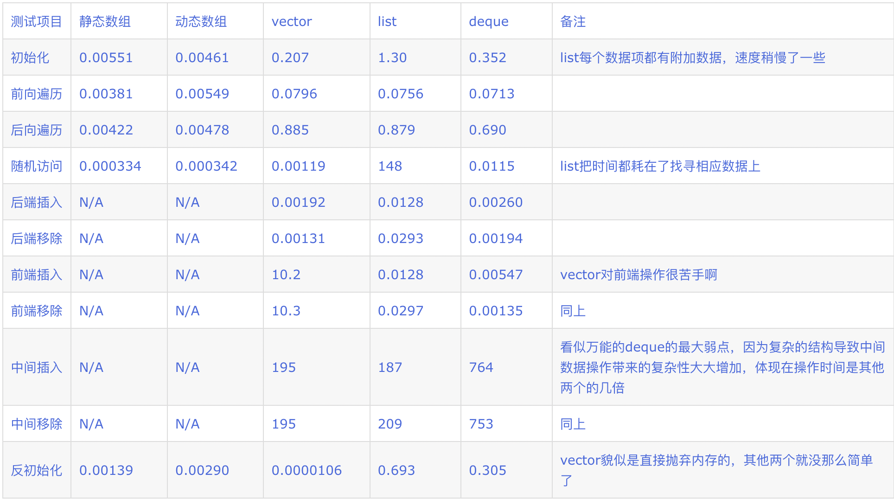

# 面试题

### 左右值

#### 左值

占用一定内存，具有可辨认的地址的对象，C++中绝大多数变量都是左值

```c++
int i = 1;   // i 是左值
int *p = &i; // i 的地址是可辨认的
i = 2; // i 在内存中的值可以改变
A a; // 用户自定义类实例化的对象也是左值
```

#### 右值

左值以外的所有对象

```cpp
int i = 2; // 2 是右值
int x = i + 2; // (i + 2) 是右值
A a = A(); // A() 是右值，是一个临时对象，在a构造完成后会被销毁
A&& a = A();	//a是一个右值引用，引用的就是A()所创建的对象，这个对象的生命周期和a一致
int i = sum(1, 2) // sum(1, 2) 是右值
```

不能对右值赋值

```c++
i + 2 = 4; // 错误，不能对右值赋值
```

不能对右值取地址

```c++
int *p = &(i + 2);//错误，不能对右值取地址
```

```c++
int square1(int& a) {return a * a;}
int square2(const int& a) {return a * a;} 
...
int i = 2;
square1(i); // 正确
square1(2); // 错误，不能对右值取地址
square2(2);	// 正确
```

为什么可以`const int &a = 2;`呢？可以视为一个例外，const引用 指向了一个 临时左值的引用，其值为2

#### 转换

左值创造右值

```c++
int i = 2;	// i是左值
int x = i + 2;	// i+2是右值
```

右值创造左值（右值变左值，就会在内存中分配空间）

```c++
int v[3];
*(v + 1) = 2;	// 指针解引用可以把右值转化为左值
```

#### 移动语意

移动语意(std::move)，可以将左值转化为右值引用

转移语意的本质是转移所有权，将一个快要被销毁的对象转移给其他变量，于是这个对象就不会被销毁（自然也不会再重新创建一个一样的对象）

#### universal references

T&&类型即可以绑定左值，也可以绑定右值，这种类型必须被初始化，根据其初始化内容确定其类型

在使用这种类型前，需要知道是左值还是右值，所以需要进行**类型推导**

经过推导的T&&类型，其类型可能会发生变化，这个变化就叫**引用折叠**

- 右值引用折叠到右值引用，还是一个右值引用
  - A&& && 变成 A&&
- 其他的引用类型的折叠会变成左值引用
  - A& & 变成 A&
  - A& && 变成 A&
  - A&& & 变成 A&

总结：左值引用会传染，**只要有一个左值就全是左值**，只有纯右值引用折叠后还是右值引用

#### 代码转发

完美转发（std::forward)

- 只有在需要的时候，才调用复制构造函数
- 左值被转发为左值，右值被转发为右值

##### 为什么需要这个东西？

在函数模版编程中，常常会把模版参数传递给另一个调用函数，如果只做值传递，会有性能浪费

```c++
template<class TYPE, class ARG>
TYPE* getInstance(ARG arg)
{
  TYPE* pRet = nullptr;
  pRet = new TYPE(arg);
  return pRet;
}
```

比如这里，用ARG的参数去初始化TYPE类型，并返回其对象指针，如果ARG非常复杂，性能会很差，如果使用完美转发：

```c++
template<class TYPE, class ARG>
TYPE* getInstance(ARG&& arg)
{
  TYPE* pRet = nullptr;
  pRet = new TYPE(std::forward<ARG>(arg));
  return pRet;
}
```

这里TYPE接受了一个右值进行初始化，把ARG的参数及类型一起转发过去

### new和malloc

|                            | new                              | malloc                      |
| -------------------------- | -------------------------------- | --------------------------- |
| 申请空间时是否调用构造函数 | 调用                             | 不会                        |
| 申请失败后返回             | 错误码bad_alloc                  | NULL                        |
| 参数                       | 不需要指定内存大小，会自动计算   | 需要指定内存大小            |
| 成功返回类型               | 对象类型的指针（是安全性操作符） | 返回void*类型，需要强制转换 |
| 重载                       | 可以重载                         | 不可以重载                  |
| 是否支持内存扩张           | 不支持                           | 支持                        |

### malloc的底层原理

维护一个内存空闲链表，具体分配策略可以参考GC

### new和delete

**new**

1. 调用operator new函数，申请内存（底层使用malloc实现）
2. 调用类的构造函数
3. 初始化成员变量
4. 返回类型指针

**delete**

1. 调用析构函数
2. 调用operator delete函数，释放内存（底层使用free实现）

```c++
A* a = (A*)malloc(4);
A* a = new A();
```

### this

是一个const指针，一个指向成员函数所作用的对象的指针

### const和static能共用吗

不能同时修饰**成员函数**

static修饰成员函数时，使这一个类只存在这一份函数，所有对象共享该函数，不含this指针

const修饰成员函数时，为了确保这个函数不能被修改，在函数中添加了一个隐式的参数const this*，由于static修饰的静态成员函数没有this指针，所以两种不能共用

### 什么是traits

是一种技术方案，用来为同一类数据提供统一的操作函数，核心就是使用另外的模版类`type_traits`存储不同数据类型的`type`，这样就可以兼容各种数据类型

```c++
enum Type {
  TYPE_1,
  TYPE_2,
  TYPE_3
}
template<typename T>
struct type_traits {
  Type type = T::type;
}
// 自定义类型
class Foo {
public:
  Type type = TYPE_1; 
};
class Bar {
public:
  Type type = TYPE_2; 
};
// 内置数据类型
template<typename int>
struct type_traits {
  Type type = Type::TYPE_1;
}
template<typename double>
struct type_traits {
  Type type = Type::TYPE_3;
}
```

```c++
// 统一的模版函数，常用于advance(), swap(), encode()/decode()等
template<typename T>
void decode<const T& data, char* buf) {
  if(type_traits<T>::type == Type::TYPE_1) {
    ...
  }
  else if(type_traits<T>::type == Type::TYPE_2) {
    ...
  }
}
```

### void**类型

在C++中

- 0或者nullptr可以转化为任意**指针类型**

- 指向任意**非常量**的指针能够转化为void\*类型
- 指向任意**常量**对象的指针能够转化为const void\*类型

而void\*\*类型，就是一个指向void\*的指针，可以理解为一个存着void\*元素的数组

### &和*

取地址运算符&，返回操作数的内存地址，&a就是a的地址

间接寻址运算符\*，返回操作数指定地址的变量的值，

### reset

`p.reset()`

- 释放p指向的空间（默认为delete）

`p.reset(q)`

- 释放p原来的空间，并使智能指针p中存放指针q，即指向q的空间
- q是要指向的对象

### 运行时多态

C++的运行时多态是基于虚函数实现，通过重载父类虚函数，当父类指针指向子类对象时，父类和子类同一个接口实现不同的行为，函数的调用地址无法在编辑器期间确定，需要在运行时确定

### RTTI机制

运行时类型识别（Run Time Type Identification，RTTI），程序能够使用基类的指针或引用来检查着这些指针或引用所指的对象的实际派生类型

C++是一门静态类型语言，数据类型需要在编译期间确定，不能运行时修改，然而C++的指针或引用可能与实际指向或引用的类型不一致，所以需要这个机制

#### typeid

返回指针和引用所指的实际类型

#### dynamic_cast

`dynamic_cast<type_id>(expression) `

将`expression`（这是一个基类对象指针或引用）安全地转化为`type_id`类型

- 如果对指针进行转换，失败了返回nullptr，成功了返回转化后的对象指针
- 如果对引用进行转换，失败了抛出异常，成功了返回转化后的对象引用

**两种情况**

- 上行转换（子转父）：转化安全，返回父对象指针，与`static_cast`本质一样

- 下行转换（父转子）
  - 父类必须有虚函数，不然报错
  - 父类指针指向子类对象，转化安全，返回父类对象指针
  - 父类指针指向父类对象，转化不安全，返回nullptr

*为啥是这俩转换？想一想什么时候需要用到RTTI，就是因为虚函数重载后，父类指针指向子类对象，无法明确指针或引用的函数调用地址*

### mutable

意思是可变的，是const的反义词，在C++中const函数中无法修改non-static变量，如果const成员函数想要修改成员变量，需要用mutable修饰

mutable不能修饰const、static类型的变量

#### 用法

比如像记录某个const函数的调用次数

```c++
class Person {
public:
  	...
    int getAge() const; 
    int getCallingTimes() const; //获取上面的getAge()方法被调用了多少次
private:
  	...
    int age;
    mutable int m_nums;   
};

Person::Person()
{
    m_nums = 0;
}

int Person::getAge() const
{
    m_nums++;
    return age;
}

int Person::getCallingTimes()const
{
    return m_nums;
}
```

### virtual底层实现

#### 什么是类

编译器会将C++编译成汇编代码，而汇编代码分为堆区、栈区、代码区、全局/静态区、常量区

- 成员方法
  - 存储在代码区
- 常量
  - 存储在常量区
- 静态变量/方法
  - 存储在全局/静态区
- 变量
  - 存储在堆、栈

#### 类的创建模式

C++的类有两种创建模式，静态创建和动态创建

- 静态创建：由编译器为对象在**栈**空间上分配内存，直接调用类的构造函数创建对象

- 动态创建：使用 new 关键字在**堆**空间上创建对象
  - 底层首先调用 operator new() 函数，在堆空间上寻找合适的内存并分配
  - 然后，调用类的构造函数创建对象

```c++
Person *p = new Person();		//动态创建，类存储在堆中
Person p;		//静态创建，类存储在栈中
```

#### 对象

对象就是变量的集合，包含类变量、vptr指针、isa指针

vptr指针指向虚函数表

isa指针指向类

*此外，this指针并不是对象的属性，并不存在堆栈离，但this存储在寄存器中，在类对象活跃时，可以通过寄存器查找到对象的地址*

#### 静态绑定与动态绑定

在编译器运行时，编译器先将所有函数翻译为机内码，再根据机内码和符号表反推出汇编代码，在这个过程中函数名就会被替代为地址，调用函数的本质就是跳转到函数地址

virtual关键词是告诉编译器，这个函数是要动态绑定的，所以不会将这个函数编译成一个固定的地址，而是将这个函数地址视为变量，存储在虚函数表中，当对象调用方法时，会通过vtpr指针找到地址变量

### 函数对象

#### 实现方式

是一种看上去像函数的对象，实现方法有很多

- 函数类（重载`()`）

```c++
class FuncObjType
{
public:
    void operator() ()
    {
        cout<<"Hello C++!"<<endl;
    }
};
...
FuncObjType f;
f();
```

- Lambda表达式：本质就是一个匿名函数

```c++
int main()
{
    int count = 0;
    std::vector<std::string> words{ "An", "ancient", "pond" };
    std::for_each(words.cbegin(), words.cend(),
                  [&count](const std::string& word)
                    {
                        std::cout << word << " " << count << std::endl;
                        count++;
                    });
    return 0;
}
```

- `std::function`类

```c++
std::function<float(float, float)> test_function;

test_function = std::fmaxf; // Ordinary function
test_function = std::multiplies<float>(); // class with a call operator
test_function = std::multiplies<>(); // class with a generic call operator
test_function = [x](float a, float b) { return a * x + b; }; // lambda
test_function = [x](auto a, auto b) { return a * x + b; }; // generic lambda
```

- `std::bind`和闭包：闭包本质上是Lambda的一个更安全的子集

Lambda表达式中，被捕获的外部变量是自由的，可能是未定义的，不受表达式约束的，所以无法评估

为了避免出现外部变量已经被销毁的情况，我们将开放的Lambda表达式，变成一个关闭的Lambda表达式，这个Lambda表达式不再有任何自由符号

#### 和普通函数的区别

普通函数一经调用就会被销毁，所以没有自己固定的成员，如果使用全局变量，就会降低封装性

### 多态的实现

- overload
  - C++中将多个语义类似、功能近似的函数用一个名字表示
  - 在同一个类中
  - virtual可有可无，**不属于多态**
- override
  - 派生类函数覆盖基类函数
  - 分别位于基类和派生类中
  - 必须有virtual关键词，属于**运行时多态**
- overwrite
  - 派生类的函数屏蔽了与其同名的基类函数（就是用子类函数地址替代父类函数地址，这样其实不太好）
  - 属于**编译时多态**
  - 如果参数不同，基类函数必被隐藏
  - 如果参数相同
    - 如果基类函数没有virtual关键词，基类函数被隐藏
    - 如果基类函数有virtual关键词，就成override了

C++中为了明确语义，所以引入`override`关键词，这东西**可有可无**，只是为了辅助检查时表示“现在正在重载基类的虚函数“

### C++函数入口为什么是main，谁调用了main

在Window平台下，进程创建后会接着创建主线程，主线程创建后就有了时间片，开始参与系统的线程调度，主线程的入口是OEP（程序入口点），这是一个相对虚拟地址，根据这个地址找到程序运行的第一个函数，在VC++中是`mainCRTStartup`，而这个函数会调用C++的`main`函数

### 虚函数内部具体的内存划分

### vector和list头插数据哪一个快

vector本质就是数组，但是在快用尽时开辟新的数组

list本质是一个双向链表

deque本质是一个双端队列



### map和unordered_map

map字典

- map的底层是一个红黑树，内部所有的数据都是有序的
  - 操作效率高
  - 空间占用高

- unordered_map的底层是一个哈希表，内部所有数据都是无序的
  - 建立速度慢
  - 查找速度快

### 实现一下shared_ptr

### 实现一下红黑树

### 函数调用约定

### 位域

多个小结构共用一个字节，从而节省空间

```
struct bName{
    int a:2;
    int b:4;
    int c:8;
};
```

这个结构一共16位，其中a是一个int类型，一共两位（其中还有一个是符号位，所以本质只有一个数值位），能表示$2^2$个数，范围是$\left[-2^1,2^1-1 \right]$

| 二进制 | 十进制 |
| ------ | ------ |
| 01     | 1      |
| 00     | 0      |
| 11     | -1     |
| 10     | -2     |

*回忆一下大一知识，正数直接转化，负数是取补码*

### delete默认函数

构造函数=delete表示禁用编译器自动生成的函数

```c++
class DataOnly {
public:
    DataOnly (const DataOnly & rhs) = delete; //禁止使用该函数
    DataOnly & operator=(const DataOnly & rhs) = delete; //禁止使用该函数
};
```

等同于

```c++
class DataOnly {
private:
    DataOnly (const DataOnly & rhs); 
    DataOnly & operator=(const DataOnly & rhs);
};
```

### explicit关键字

声明为`explicit`的构造函数不能隐式转换

一般只会把单一参数的构造函数声明为`explicit`（拷贝构造函数不会这样声明）

### final关键字

- 将**类**标记为final后不可被继承
- 将**方法**标记为final后不可被重写

### volatile关键字

被其声明的变量可以被某些编译器未知的因素更改，比如操作系统、硬件、**其他线程**，于是编译器不会对该变量的访问做优化，于是可以从内存中对其进行稳定访问

在访问时，系统总是重新去内存中读数据（不使用访问加速）

### std:call_once

用于保证一段程序只被执行一次（在多线程中初始化有用）

```c++
//单线程中通过锁来实现一次执行
static std::vector<std::string> staticData;
void foo ()
{
    if (staticData.empty ()) {
        staticData = initializeStaticData ();
    }
}
```

```c++
//stl:call_once
void foo()
{
    static std::once_flag oc;
    std::call_once(oc, [] { staticData = initializeStaticData ();});
}
```

