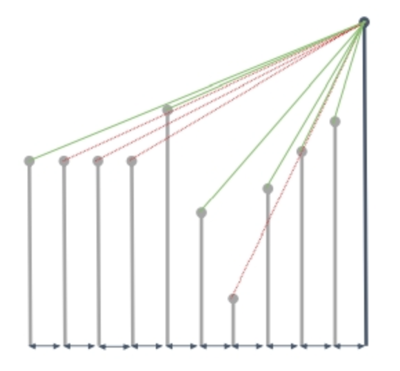
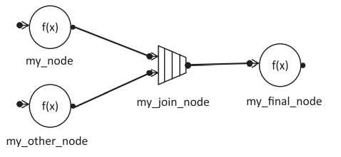
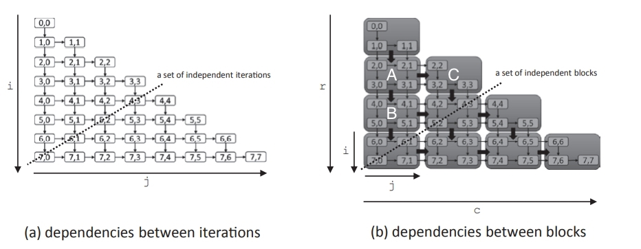

# 高性能C++

在摩尔定律逐渐失效的今日，CPU主频和单核性能提升越来越不明显，为了得到跟高的性能，我们走向了并行计算的道路

## 概念

### 并发和并行

- 并发（Concurrent）：happening during the same time span，处理器在两件事间快速切换，宏观上看，就像是同时发生的（下图AB）

- 并行（Parallel）：happening at the same time，多个处理器一起做事（下图CD）


## TBB基础

TBB（Threading Building Blocks）是一个非常流行的C++并行编程（parallel programming）方案

- 使用Task而非Thread
  - Thread与硬件相关，直接编写难以跨平台，而且线程间通信过于频繁，过于繁琐
  - TBB使用Task编程，运行时会将程序映射到硬件上（该方法对嵌套并行的支持很不错）

- TBB实现了可组合性（Composability）
  - 简单来说就是支持for循环

- 方便移植（portable）

### Mac上安装使用TBB

1. 安装tbb

```sh
$brew install tbb
```

2. 链接tbb

```cmake
#寻找tbb包
find_package(TBB REQUIRED)
...
#链接
target_link_libraries(TimeStudy TBB::tbb)
```

3. 引用头文件

```c++
#include<tbb/tbb.h>
```

### 调用函数

```c++
template<typename Func0, [...,] typename FuncN>
void parallel_invoke(const Func0& f0, [...,] const FuncN& fN);
```

一个简单的TBB示例，并行输出两行字符串

通过`tbb::parallel_invoke`实现任务、函数粒度的并行

```c++
#include <iostream>
#include <tbb/tbb.h>

int main() {
    tbb::parallel_invoke(
            [](){std::cout << "TBB!" << std::endl;},
            [](){std::cout << "Hello" << std::endl;}
            );
    return 0;
}
```

我们这里使用lambda表达式创建了匿名（anonymous）函数，可以大幅简化TBB编写

#### 快排示例

传统快排算法（升序）

1. 在数列中取一个数作为基准数
2. 比基准小的放在基准左边，大的放在右边
3. 对左右两边分别快排，直到只剩一个数（左右重合）

能看出，这个算法采用了分治的思想，很适合并行

```c++
#include <iostream>
#include <vector>
#include <tbb/tbb.h>

using QV = std::vector<int>;
//传统快排
void quickSort(QV::iterator left, QV::iterator right){
    if(left >= right){ return; }
    int pivot_value = *left;
    QV::iterator i = left, j = right - 1;
    while(i != j){
        while(i != j && pivot_value < *j) --j;    //从右向左找，直到找到一个比基准小的
        while(i != j && pivot_value >= *i) ++i;   //从左往右找，直到找到一个比基准大的
        std::iter_swap(i, j);
    }
    std::iter_swap(left, i);
    quickSort(left, i);
    quickSort(j+1, right);
}
//并行快排
void parallelQuicksort(QV::iterator left, QV::iterator right){
    if(left >= right){ return; }
    int pivot_value =  *left;
    QV::iterator i = left, j = right - 1;
    while (i != j) {
        while (i != j && pivot_value < *j) --j;
        while (i != j && pivot_value >= *i) ++i;
        std::iter_swap(i, j);
    }
    std::iter_swap(left, i);

    // recursive call
    tbb::parallel_invoke(
      			//lambda表达式[=]表示传入当前函数所有的成员
            [=]() { parallelQuicksort(left, i); },
            [=]() { parallelQuicksort(i + 1, right); }
    );

}

int main() {
    std::vector<int> nums;
    for(int i = 0; i < 5000; ++i){
        nums.push_back(rand() % 5000);
    }
  	//warmup
    tbb::parallel_for(0, 10, [](int) {
        tbb::tick_count t0 = tbb::tick_count::now();
        while ((tbb::tick_count::now() - t0).seconds() < 0.01);
    });

    std::vector<int> nums2 = nums;
    tbb::tick_count t0 = tbb::tick_count::now();
    quickSort(nums.begin(), nums.end());
    std::cout << "Normal Time=" << (tbb::tick_count::now() - t0).seconds() << std::endl;

    tbb::tick_count t1 = tbb::tick_count::now();
    parallelQuicksort(nums2.begin(), nums2.end());
    std::cout << "Parallel Time=" << (tbb::tick_count::now() - t1).seconds() << std::endl;
    return 0;
}
```

最后结果，当数组比较大的时候，并行快排速度会更快一点

```
Normal Time=0.0023285
Parallel Time=0.00110846
```

### 时刻查询

```c++
//t0时刻
tbb::tick_count t0 = tbb::tick_count::now();	
...
//当前时刻-t0时刻=经过了多长时间段（并转化为秒）
std::cout << "Time: " << (tbb::tick_count::now() - t0).seconds() << " seconds" << std::endl;
```

并行开发中动态内存管理十分复杂、危险（内存泄漏），这里推荐使用C++11的智能指针（自带GC）

### Flow Graph

将函数执行制作成Graph，实现消息驱动的并行（有些类似FrameGraph）


```c++
void fig1_10(const std::vector<ImagePtr>& image_vector){
    const double tint_array[] = {0.75, 0, 0};

    tbb::flow::graph g;
    int i = 0;
    //注意，source_node已经失效
    tbb::flow::input_node<ImagePtr> src(g,
        [&i, &image_vector](tbb::flow_control &fc) -> ImagePtr {
            if(i < image_vector.size()){
                return image_vector[i++];
            }
            else{
                fc.stop();
                return {};
            }
    });
    tbb::flow::function_node<ImagePtr, ImagePtr> gamma(g,
        tbb::flow::unlimited, [] (ImagePtr img) -> ImagePtr{
                return applyGamma(img, 1.4);
        }
    );
    tbb::flow::function_node<ImagePtr, ImagePtr> tint(g,
        tbb::flow::unlimited, [tint_array] (ImagePtr img) -> ImagePtr{
                return applyTint(img, tint_array);
        }
    );
    tbb::flow::function_node<ImagePtr> write(g,
         tbb::flow::unlimited, [] (ImagePtr img){
                writeImage(img);
        }
    );

    tbb::flow::make_edge(src, gamma);
    tbb::flow::make_edge(gamma, tint);
    tbb::flow::make_edge(tint, write);
    src.activate();
    g.wait_for_all();
}
```

最后该程序会以**流水线**的形式执行，当第一张图片完成gamma矫正，去执行tint着色时，第二张图片开始执行gamma矫正（每张图片间互不影响）

相比于TimeStudy的串型执行，流水线执行效率会更快

### 循环

```c++
template<typename Index, typename Func>
Func parallel_for(Index frist, Index last, [Index step,] const Func& f);
```

上面的代码，我们将图片处理切分为几个小块，但小块内部仍然是单线程

我们注意到，在图片处理时，有一个很大的循环在遍历图片上的像素点，那么能不能并行做这件事？

我们并行处理每一行

```c++
tbb::parallel_for(0, height,
                  [&in_rows, &out_rows, width, gamma](int i){
                    for(int j = 0; j < width; ++j){
                      const ImageLib::Image::Pixel& p = in_rows[i][j];
                      double v = 0.3 * p.bgra[2] + 0.59 * p.bgra[1] + 0.11 * p.bgra[0];
                      double res = pow(v, gamma);
                      if(res > ImageLib::MAX_BGR_VALUE){
                        res = ImageLib::MAX_BGR_VALUE;
                      }
                      out_rows[i][j] = ImageLib::Image::Pixel(res, res, res);
                    }
                  }
                 );
```

```c++
tbb::parallel_for(0, height,
                  [&in_rows, &out_rows, width, tints](int i){
                    for(int j = 0; j < width; ++j){
                      const ImageLib::Image::Pixel& p = in_rows[i][j];
                      std::uint8_t b = (double)p.bgra[0] + (ImageLib::MAX_BGR_VALUE - p.bgra[0]) * tints[0];
                      std::uint8_t g = (double)p.bgra[0] + (ImageLib::MAX_BGR_VALUE - p.bgra[1]) * tints[1];
                      std::uint8_t r = (double)p.bgra[0] + (ImageLib::MAX_BGR_VALUE - p.bgra[2]) * tints[2];
                      out_rows[i][j] = ImageLib::Image::Pixel(
                        (b > ImageLib::MAX_BGR_VALUE) ? ImageLib::MAX_BGR_VALUE : b,
                        (g > ImageLib::MAX_BGR_VALUE) ? ImageLib::MAX_BGR_VALUE : g,
                        (r > ImageLib::MAX_BGR_VALUE) ? ImageLib::MAX_BGR_VALUE : r
                      );
                    }
                  }
                 );
```

M1 Mac Xcode Clang至今不支持C++17的std::execution，对OpenMP的支持也相当差

### 归约

```c++
template<typename Range, typename Value, typename Func, typename Reduction>
Value parallel_reduce(const Range& range, const Value& identity, const Func& func, const Reduction& reduction);
```

#### 求最大值

下面是一个vector求最大值的示例，实现机制就是将整个数组分成一个个小块（chunks），分别对小块求最值，然后将小块归约（reduce），最后求得最值（形成了一个树型结构）

```c++
int pmax(const std::vector<int> &arr){
    int max_value = tbb::parallel_reduce(
      			//range，扫描范围
            tbb::blocked_range<int>(0, arr.size()),	
      			//identity，小块数据的初始值，这里赋值为int类型的最小值-2147483648
            std::numeric_limits<int>::min(),	
      			//func，每个小块的处理方式
            [&](const tbb::blocked_range<int> &r, int init) -> int{	
                for(int i = r.begin(); i != r.end(); ++i){
                    init = std::max(init, arr[i]);
                }
                return init;
            },
      			//reduction，小块间合并的处理方式
            [](int x, int y) -> int{
                return std::max(x, y);
            }
    );
    return max_value;
}
```

下面这是一个求PI的示例

```c++
double calcPI(int degree){
    double dx = 1.0 / degree;
    double sum = tbb::parallel_reduce(
      			//range，扫描范围
            tbb::blocked_range<int>(0, degree),
      			//identity，小块数据的初始值，这里赋值为0
            0.0,
      			//func，每个小块的处理方式
            [=](const tbb::blocked_range<int> &r, double init) -> double{
                for(int i = r.begin(); i != r.end(); ++i){
                    double x = (i + 0.5)*dx;
                    double h = std::sqrt(1 - x*x);  //勾股定理
                    init += h * dx;
                }
                return init;
            },
      			//reduction，小块间合并的处理方式
            [](double x, double y) -> double{
                return x+y;
            }
        );
    return 4 * sum;
}
```

### 扫描

```c++
template<typename Range, typename Value, typename Scan, typename Combine>
Value parallel_scan(const Range& range, const Value& identity, const Scan& scan, const Combine& combine);
```

#### 前缀和

*前缀和在图形领域也有很大的用处*

对于一个数组，我们将其分为三个小块ABC

```
A.init=0, B.init=0
scan(A), scan(B)

B.init = A.ans
C.init = A.ans + B.ans
scan(B), scan(C)
```

最后我们只用了串行2/3的扫描时间，但是多做了1/3的扫描工作，时间减少了，但是工作量变大了

```c++
int parallelPrefix(const std::vector<int> &v, std::vector<int> &psum){
    int N = v.size();
    psum[0] = v[0];
    int final_sum = tbb::parallel_scan(
      			//range
            tbb::blocked_range<int>(1, N),
      			//identity
            (int)0,
      			//scan body
            [&v, &psum](const tbb::blocked_range<int> &r, int sum, bool is_final_scan) -> int{
                for(int i = r.begin(); i < r.end(); ++i){
                    sum += v[i];
                    if(is_final_scan){
                        psum[i] = sum;
                    }
                }
                return sum;
            },
      			//combine body
            [](int x, int y){
                return x+y;
            }
        );
    return final_sum;
}
```

#### 可见性

如图，等间距摆放一个个薄板（厚度忽略不计），从最右上角向左看，能看到哪些薄板？



解题的本质就是比较夹角大小，只要夹角一直递增，就能看到

```c++
void visibility(const std::vector<double> &heights, std::vector<bool> & visible, double dx){
    const int N = heights.size();
    double max_angle = std::atan2(dx, heights[0] - heights[1]);

    double final_max_angle = tbb::parallel_scan(
      			//range
            tbb::blocked_range<int>(1, N),
      			//identity
            0.0,
      			//scan body
            [&heights, &visible, dx](const tbb::blocked_range<int> &r, double max_angle, bool is_final_scan) -> double {
                for(int i = r.begin(); i != r.end(); ++i){
                    double my_angle = atan2(i * dx, heights[0] - heights[i]);
                    if(my_angle >= max_angle){
                        max_angle = my_angle;
                    }
                    else if(is_final_scan){
                        visible[i] = false;
                    }
                }
                return max_angle;
            },
      			//combine body
            [](double a, double b){
                return std::max(a, b);
            }
        );
}
```

### parallel_for_each

parallel_for在使用时必须指定range，但如果要处理的item数量不确定（比如在执行过程中修改itemList），那么就不能使用，这个时候我们可以使用parallel_for_each

```c++
template <typaname InputIterator, typename Body>
void parallel_for_each( InputIterator first, InputIterator last, Body body );
```

下面是一个遍历树的示例，若一个节点的`v.first`为prime，将其`v.second`修改为true。我们不知道树有多大，于是采用递归遍历

```c++
void f(PrimesTreeElement::Ptr root){
  PrimesTreeElement::Ptr tree_arry[] = {root};
  //tbb::parallel_do已经废弃
  tbb::parallel_for_each(
        tree_array,
        [](PrimesTreeElement::Ptr e, 
        //tbb::parallel_do_feeder已被废弃
        tbb::feeder<PrimesTreeElement::Ptr>& feeder){
        if(e){
          if(isPrime(e->v.first)) e->v.second = true;
          if(e->left) feeder.add(e->left);
          if(e->right) feeder.add(e->right);
        }
      }                 
  );
}
```

#### 前向替换

前向替换（Forward Substitution）是线性代数中一种求解线性方程组的方法

一般解线性方程组有两种方法：

- 直接法
  - 高斯消元法
  - LU分解法
- 迭代法

高斯消元法：初中就学了，就是两个方程变化后相加减（也可以换元），消除变量，直到得到解。这个方法可以拓展到矩阵中，就是把线性方程转化为行阶梯矩阵（中间那个矩阵），然后简化为简化行阶梯矩阵（右边那个矩阵）
$$
\left[
\begin{matrix}
2 & 1 & -1 &|& 8	\\
-3 & -1 & 2 & | & -11 \\
-2 & 1 & 2 & | & -3
\end{matrix}
\right]
=>
\left[
\begin{matrix}
2 & 1 & -1 &|& 8	\\
0 & 1/2 & 1/2 & | & 1 \\
0 & 0 & -1 & | & 1
\end{matrix}
\right]
=>
\left[
\begin{matrix}
1 & 0 & 0 &|& 2	\\
0 & 1 & 0 & | & 3 \\
0 & 0 & 1 & | & -1
\end{matrix}
\right]
$$

前向替换法就是得到行阶梯矩阵后
$$
\left[
\begin{matrix}
a_{11} & 0 & \cdots &  0	\\
a_{21} & a_{22} & \cdots & 0  \\
\vdots & \vdots &\ddots & \vdots \\ 
a_{n1} & a_{n2} &  \cdots & a_{nn}
\end{matrix}
\right]

\left[
\begin{array}{c}
	x_1\\
	x_2\\
	\vdots\\
	x_n\\
\end{array}
\right]
=
\left[
\begin{array}{c}
	b_1\\
	b_2\\
	\vdots\\
	b_n\\
\end{array}
\right]
$$
能写出以下式子
$$
\begin{cases}	
x_1 = b_1/a_{11} \\
x_2 = (b_2-a_{21}x_1)/a_{22}	\\
\ \vdots	\\
x_n = (b_n -a_{n1}x_1-a_{n2}x_2 - \cdots -a_{nn-1}x_{n-1})/a_{nm}
\end{cases}
$$
于是我们只需要从第一个式子开始，逐步向下替换，就能求出方程的解

*如果是下三角矩阵，那就是后向替换*

```c++
//a是一个下三角矩阵，x、b是向量
void serialFS(std::vector<double>& x, const std::vector<double>& a, std::vector<double>& b) {
    const int N = x.size();
    for (int i = 0; i < N; ++i) {
        for (int j = 0; j < i; ++j) {
            b[i] -= a[j + i*N] * x[j];
        }
        x[i] = b[i] / a[i + i*N];
    }
}
```

加入分块和并行后：

```c++
void parallelFS(std::vector<double> &x, const std::vector<double> &a,
                std::vector<double> &b) {
  const int N = x.size();
  const int block_size = 512;
  const int num_blocks = N / block_size;
  //tbb::atomic已经废弃
  std::vector<std::atomic<char>> ref_count(num_blocks * num_blocks);
  for (int r = 0; r < num_blocks; ++r) {
    for (int c = 0; c <= r; ++c) {
      if (r == 0 && c == 0)
        ref_count[r * num_blocks + c] = 0;
      else if (c == 0 || r == c)
        ref_count[r * num_blocks + c] = 1;
      else
        ref_count[r * num_blocks + c] = 2;
    }
  }

  using BlockIndex = std::pair<size_t, size_t>;
  BlockIndex top_left(0, 0);
  //tbb::parallel_do已经废弃
  tbb::parallel_for_each(&top_left, &top_left + 1,
                         [&](const BlockIndex &bi, tbb::feeder<BlockIndex> &feeder) {
                           size_t r = bi.first;
                           size_t c = bi.second;
                           int i_start = r * block_size, i_end = i_start + block_size;
                           int j_start = c * block_size, j_max = j_start + block_size - 1;
                           for (int i = i_start; i < i_end; ++i) {
                             int j_end = (i <= j_max) ? i : j_max + 1;
                             for (int j = j_start; j < j_end; ++j) {
                               b[i] -= a[j + i * N] * x[j];
                             }
                             if (j_end == i) {
                               x[i] = b[i] / a[i + i * N];
                             }
                           }
                           // add successor to right if ready
                           if (c + 1 <= r && --ref_count[r * num_blocks + c + 1] == 0) {
                             feeder.add(BlockIndex(r, c + 1));
                           }
                           // add succesor below if ready
                           if (r + 1 < (size_t) num_blocks && --ref_count[(r + 1) * num_blocks + c] == 0) {
                             feeder.add(BlockIndex(r + 1, c));
                           }
                         }
                        );
}
```


## Flow Graphs

并行编程另一个问题是混乱，传统并行编程为了避免程序混乱（messy），我们需要事无巨细地管理每一件事。但在上一节简单提到的Flow Graphs，提供了一个简单的管理方法

Flow Graphs允许我们用图（DAG）来描述程序，相比于`parallel_do`和`parallel_pipeline`，FlowGraphs自由度更高，推荐使用。

- 每个节点是一个并行函数，箭头代表数据的流向/消息传递，我们将这个图称为数据流向图（data flow graphs）
- 图也可以描述操作的前后顺序，进而可以构建一些传统方法难以表示的独立结构体，这种图被称为独立图（dependency graphs）

### 预热

```c++
static void warmupTBB() {
    //tbb::task_scheduler_init::default_num_threads()已经弃用
    tbb::parallel_for(0, tbb::this_task_arena::max_concurrency(), [](int) {
        tbb::tick_count t0 = tbb::tick_count::now();
        while ((tbb::tick_count::now() - t0).seconds() < 0.01);
    });
}
```

无论是web服务器、CPU/GPU并行计算，深度学习，都有warmup的概念

对于一个项目，如果采用冷启动的方式，从零瞬间增加计算量，可能会把系统压垮，于是我们可以使用warmup，逐步提高项目负荷。

### 数据流图

1. 构建图对象
2. 创建节点，填充节点信息
3. 链接节点
4. 发送消息
5. 等待图完成

```c++
void graphSample(){
    //创建图对象
    tbb::flow::graph g;
    //创建节点
    tbb::flow::function_node<int, std::string> my_first_node(
            g, tbb::flow::unlimited,
            [](const int &in) -> std::string{
                std::cout << "first node received: " << in << std::endl;
                return std::to_string(in);
            }
        );
    tbb::flow::function_node<std::string> my_second_node(
            g, tbb::flow::unlimited,
            [](const std::string &in){
                std::cout << "second node received: " << in << std::endl;
            }
        );
    //链接
    tbb::flow::make_edge(my_first_node, my_second_node);
    //发送消息
    my_first_node.try_put(10);
    //等待图完成
    g.wait_for_all();
}
```

#### 节点

Flow Graphs有三种节点

- functional
- control flow
- buffering

##### function_node

```c++
template<typename Body>
function_node(graph& g, size_t concurrency, Body body);
```

函数节点，当消息传递到该节点，会被函数处理，并将输出值传递给后继者

```c++
//输入一个int类型，输出一个std::string类型
tbb::flow::function_node<int, std::string> my_first_node(
  					//图对象
            g, 	
  					//节点的并发限制，0是无限制(unlimited)，1是串行(serial)
  					tbb::flow::unlimited,	
  					//body
            [](const int &in) -> std::string{
                std::cout << "first node received: " << in << std::endl;
                return std::to_string(in);
            }
        );
```

函数节点可以从他所连接（edges）其他节点获取消息，也可以使用`try_put`手动向其传递消息

##### join_node

```c++
template <typename Body, typename... Bodies>
join_node(graph&, Body, Bodies...)->join_node<std::tuple<std::decay_t<input_t<Body>>, std::decay_t<input_t<Bodies>>...>, key_matching<output_t<Body>>>;
```

流控制节点，当消息传递到该节点，会创建一个消息元组（tuple），然后将元组广播给所有后继者



```c++
//my_node，输入int，输出std::string
tbb::flow::function_node<int, std::string> my_node{...};
//my_other_node，输入int，输出double
tbb::flow::function_node<int, double> my_other_node{...};
//join节点，这里的作用是将两个节点的输出整合，传递给my_final_node
tbb::flow::join_node<std::tuple<std::string, double>,
            tbb::flow::queueing> my_join_node{g};
//my_final_node，输入一个元组
tbb::flow::function_node<std::tuple<std::string, double>, int> my_final_node{g,
                   tbb::flow::unlimited,
                   [](const std::tuple<std::string, double>& in) -> int {
                     std::cout << "final: " << std::get<0>(in)
                       << " and " << std::get<1>(in) << std::endl;
                     return 0;
                   }
                  };
```

有的时候，我们需要保证`join_node`的输入的对应的。比如我想将两张照片拼成一张，我开两个节点并行读项目，再用`join_node`整合后传入merge函数节点，然而在这个过程中，我必须保证传入的两个像素点在同一位置，为此，我们可以添加一个frameNumber做标记（tags）

```c++
//使用函数对象作为tags，可以用input_port<i>读出来
tbb::flow::join_node<std::tuple<Image, Image>, tbb::flow::tag_matching >
    join_images_node(g, [] (Image left) { return left.frameNumber; },
                        [] (Image right) { return right.frameNumber; } );
...
tbb::flow::make_edge(increase_left_node, tbb::flow::input_port<0>(join_images_node));
tbb::flow::make_edge(increase_right_node, tbb::flow::input_port<1>(join_images_node));
tbb::flow::make_edge(join_images_node, merge_images_node);
```

#### 链接

```c++
template<typename Message>
    inline void make_edge( sender<Message> &p, receiver<Message> &s );
template< typename MultiOutputNode, typename MultiInputNode >
    inline void make_edge( MultiOutputNode& output, MultiInputNode& input );
```

我们可以使用`make_edge`链接两个节点

```c++
//这里的input_port是一种sender，跟节点差不多，都能互相链接
make_edge(my_node, tbb::flow::input_port<0>(my_join_node));
make_edge(my_other_node, tbb::flow::input_port<1>(my_join_node));
make_edge(my_join_node, my_final_node);
```

#### 激活

为了激活图，我们需要向图中传递消息，除了前文的`try_put`，我们也可以使用`input_port`

```c++
//my_node是一个input_node
my_node.activate();	//将其设为活动状态，启用消息生成
```

#### 等待

```c++
g.wait_for_all();
```

### 性能限制

Flow Graphs是一个基于Task的并行框架，当消息到达一个节点时，根据节点的并发限制，创建Task。生成的Task会进一步映射为线程（跟上一节讲的循环、算法的机制一样）

真正限制Flow Graphs性能的有

- 串行节点（serial node）
- 工作线程数
- 任务复杂度

### 独立图

*很像RenderGraph*

|              | 数据流向图    | 独立图             |
| ------------ | ------------- | ------------------ |
| Edges含义    | 表示数据流向  | 表示节点的先后顺序 |
| 信息传递方式 | 消息          | shared memory      |
| 节点类型     | function_node | continue_node      |

- 节点的先后顺序，描述的是依赖关系，只有前面节点执行结束后，后面节点才能安全、正确地执行

- 独立图不使用函数节点，而是继续节点`continue_node`，节点间的消息传递使用，当传入`continue_node`的消息（`continue_msg`）数量等于该节点需要的消息数量，节点内的函数会开始执行
- `continue_node`只关心传入的消息数量，不关心消息源。这导致独立图必须是非循环的（acyclic），因为一个物体循环发出两次消息，（在这里）等同于两个物体各发出一次消息

#### 示例

之前我们使用`parallel_do`实现了一份前向替换，我们现在用独立图再实现一次




## 资料

[Pro TBB](https://github.com/Apress/pro-TBB)

[API Document](https://spec.oneapi.io/versions/latest/elements/oneTBB/source/nested-index.html)

[代码仓库](https://github.com/Reuben-Sun/TBB--Programing-Sample)
